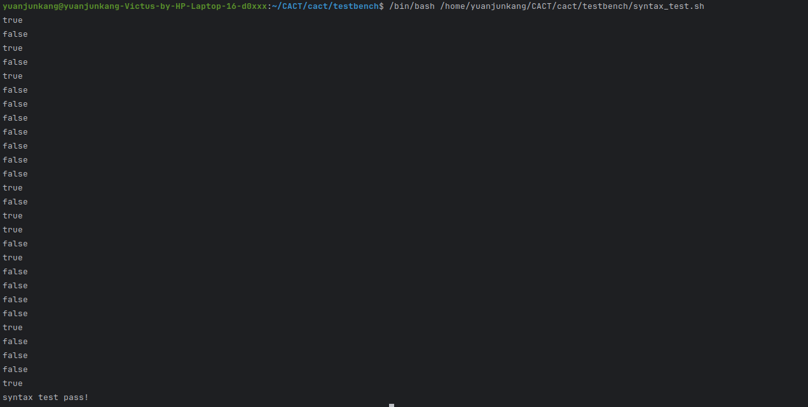

[toc]

# 编译原理研讨课实验PR001实验报告

## 任务说明

1.熟悉ANTLR的安装和使用，了解ANTLR工具的作用和工作原理，搭建ANTLR环境并运行demo

2.根据CACT文法规范编写ANTLR文法文件，完成词法和语法分析功能，完善词法文法错误检查，实现一个简单的编译器前端，并通过测试样例

## 成员组成

汪铭煜

盛子轩

苑骏康

## 实验设计

### 设计思路

#### 1.设计编译器的⽬录结构

> /cact/src/
> main.cpp: 编译器的主框架
> SemanticAnalyzer.h
> SemanticAnalyzer.cpp: 语义分析器，本次实验中实现了生成抽象语法树、语法分析的功能

#### 2.表达式优先级在⽂法设计中的体现

不同表达式的优先级可以通过文法的设计来实现，比方说

    A -> B (+ B)*
    B -> C (* C)*

就实现了乘法运算的优先级高于加法运算

利用类似的方式，我们把各种表达式的优先级做出区分，从高到低依次为：

    一元运算(包括+、-、！)表达式
    乘法、除法、取模表达式
    加法、减法表达式
    大于、小于、大于等于、小于等于表达式
    等于、不等于表达式
    逻辑与表达式
    逻辑或表达式

#### 3.设计数值常量的词法规则

数值常量分为两个类型：整型和单精度浮点型

其中，整型常量分为三种表示方式：

    十进制：一个非零的数字，连接0个或者更多[0-9]个数字
    八进制：以数字0开始，连接0个或者更多个[0-7]的数字
    十六进制：以0x或者0X开始，连接1个或者更多个[0-9]的数字或者[a-f]或者[A-F]

浮点常量分为两个表示方式：

    小数 (e或者E (正负符号)? 数字序列)? (f或者F)?
    数字序列 (e或者E (正负符号)? 数字序列) (f或者F)?

其中数字序列由1个或者更多个[0-9]的数字组成

小数包括三种形式：

    '.' 数字序列
    数字序列 '.' 数字序列
    数字序列 '.'

#### 4.替换ANTLR的默认异常处理⽅法

修改src文件夹下的main.cpp和SemanticAnalyzer.cpp，修改其检查异常的方式

利用ANTRL工具提供的API来检查词法和语法错误：

    lexer.getNumberOfSyntaxErrors()
    parser.getNumberOfSyntaxErrors()

它们的作用分别是获取在词法分析/语法分析过程中的错误数量，只有在它们的返回值都为0时，认为当前分析的语言是正确的

当出现词法或者文法错误时，打印相应的错误信息，最后通过返回值来代表正确和错误。0代表正确，1代表错误。

### 实验实现

#### 1.搭建ANTLR环境，运行demo

使⽤ANTLR⼯具⽣成visitor的C++代码

```bash
java -jar ../deps/antlr-4.13.1-complete.jar -Dlanguage=Cpp CACT.g4 -visitor -no-listener
```

编译cact项⽬⽂件夹,在build⽬录下测试

```bash
mkdir -p build
cd build
cmake ..
make
./compiler
```

#### 2.编写语法描述文件

> /cact/grammar/CACT.g4

关键代码解析：

各类表达式的文法设计如下，这样的文法设计决定了各类运算的优先级顺序

```g4
/*以下优先级是往下递减的，A->B op B，则B的优先级比A的优先级要高 */
//unaryExpression的优先级比较高
multiplicativeExpression
    : unaryExpression (op=('*' | '/' | '%') unaryExpression)*
    ;

additiveExpression
    : multiplicativeExpression (op=('+' | '-') multiplicativeExpression)*
    ;

relationalExpression
    : additiveExpression (op=('<' | '>' | '<=' | '>=') additiveExpression)?
    ;

equalityExpression
    : relationalExpression (op=('==' | '!=') relationalExpression)?
    ;

logicalAndExpression
    : equalityExpression (op='&&' equalityExpression)*
    ;

logicalOrExpression
    : logicalAndExpression (op='||' logicalAndExpression)*
    ;
```

数值常量的词法规则如下，实现了设计思路中所述的整型和单精度浮点型两种数值常量

```g4
IntegerConstant
    : DecimalConstant
    | OctalConstant
    | HexadecimalConstant
    ;

FloatingConstant
    : FractionalConstant ExponentPart? FloatingSuffix?
    | DigitSequence ExponentPart FloatingSuffix?
    ;

fragment DecimalConstant
    : NonzeroDigit Digit*
    ;

fragment OctalConstant
    : '0' OctalDigit*
    ;

fragment HexadecimalConstant
    : HexadecimalPrefix HexadecimalDigit+
    ;

fragment HexadecimalPrefix
    : '0' [xX]
    ;

fragment NonzeroDigit
    : [1-9]
    ;

fragment OctalDigit
    : [0-7]
    ;

fragment HexadecimalDigit
    : [0-9a-fA-F]
    ;

fragment FractionalConstant
    : DigitSequence? '.' DigitSequence
    | DigitSequence '.'
    ;

fragment ExponentPart
    : [eE] Sign? DigitSequence
    ;

fragment Sign
    : [+-]
    ;

fragment DigitSequence
    : Digit+
    ;

fragment FloatingSuffix
    : [fF]
    ;
```

#### 3.使用ANTLR工具，根据语法描述文件，生成词法分析器、语法分析器等模块

运行CMake项目gen_files_form_g4

```bash
add_custom_target(
    gen_files_form_g4
    COMMAND echo "Using antlr4 to generate files from grammar file..."
    COMMAND java -jar ../deps/antlr-4.13.1-complete.jar -Dlanguage=Cpp ../grammar/CACT.g4 -visitor -no-listener
    VERBATIM
)
```

#### 4.替换ANTLR的默认异常处理⽅法

关键代码解析：

> /cact/src/SemanticAnalyzer.cpp

调用getNumberOfSyntaxErrors()接口检查是否有词法或者语法错误，当出现词法或者文法错误时，打印相应的错误信息，最后输出true或者false表示是否是正确的语法

```cpp
SemanticAnalyzer::SemanticAnalyzer(std::ifstream *stream) : input(*stream), lexer(&input), tokens(&lexer),
                                                           parser(&tokens) {
    root = this->parser.compilationUnit();

    if (this->parser.getNumberOfSyntaxErrors() > 0 || this->lexer.getNumberOfSyntaxErrors() > 0) {
        std::cerr << "lexer error: " << lexer.getNumberOfSyntaxErrors() << std::endl;
        std::cerr << "parser error: " << parser.getNumberOfSyntaxErrors() << std::endl;
        throw std::runtime_error("Syntax analysis failed");
    }
}
```

在main函数中，添加了检查命令行参数缺失、检查打开文件是否成功的代码，之后调用analyzer来检查语法错误，在出错时返回1，在没有语法错误时返回0

```cpp
int main(int argc, const char* argv[]) {
  	if (argc < 2) {
   	 	std::cerr << "Error: Missing source file" << std::endl;
		return 1;
	}
	std::ifstream stream;
	stream.open(argv[1]);

    if (!stream.is_open()) {
        std::cerr << "Error: Fail to open " << argv[1] << std::endl;
        return 1;
    }

    try {
        SemanticAnalyzer analyzer(&stream);
    } catch (const std::exception &e) {
        std::cerr << "Error: " << e.what() << std::endl;
        return 1;
    }

	return 0;
}
```

#### 5.运行cmake project，编译源代码，生成可执行的compiler文件

```
mkdir -p build
cd build
cmake ..
make -j
```

#### 6.在测试用例上运行compiler，并根据测试结果修改bug

在demo中，只在一个测试样例上进行了测试。在后续的实验中，为了在更多测试用例上依次运行compiler进行测试，并方便地更改测试用例集合，我们编写了一个脚本，依次解析目标路径下的每个测试样例，与正确结果进行对比，直到通过全部测试用例，或者返回值与答案不一致时退出，在返回值与答案不一致时，打印出错信息

> /cact/testbench/syntax_test.sh

```bash
#!/bin/bash

prj_dir="/home/yuanjunkang/CACT/cact"

compiler="$prj_dir/cmake-build-debug/compiler"

cact_dir="$prj_dir/test/samples_lex_and_syntax"

for file in "$cact_dir"/*.cact; do
    if [[ -f "$file" ]]; then
        filename=$(basename "$file")
        ans=$(echo "$filename" | grep -E "[0-9][0-9]_(true|false)" -o | grep -E "(true|false)" -o | tail -n 1)
        $compiler "$file" 2>/dev/null
        return_value=$?
        if [[ $return_value -eq 1 ]]; then
            out="false"
        elif [[ $return_value -eq 0 ]]; then
            out="true"
        else
            out="unknown return value"
        fi
        if [[ "$out" != "$ans" ]]; then
            echo syntax test failed at "$filename"
            echo return value is "$return_value"
            $compiler "$file"
            exit 1
        fi
    fi
done

echo syntax test pass!

exit 0
```

同时我们还修改了CMakeLists.txt, 在其中增加了Ctest，使得我们可以自动化的编译程序并进行评测

```cmake
add_test(
        NAME syntax_test
        COMMAND ${CMAKE_CURRENT_SOURCE_DIR}/testbench/syntax_test.sh
)
```

### 其它

#### 1.ANTLR工具生成词法-语法原码的能力

ANTLR是目前非常流行的语言识别工具，使用Java语言编写，基于LL(\*)解析方式，使用自上而下的递归下降分析方法。通过输入语法描述文件来自动构造自定义语言的词法分析器(lexer)、语法分析器(parser)和树状分析器等各个模块，并提供遍历语法树的接口。

LL(\*)算法的概念和原理：传统地讲，LL(1), LL(2)直至LL(k)，也就是该解析器能够在语法分析过程中超前查看1, 2, k…个token。而LL(\*)的意思就是，它在语法解析的过程中，超前查看的token个数不是固定的，是可伸缩的，不过这一点LL(k)分析也能做到(在k范围之内…)；但是，LL(\*)还能越过一些重复出现的token，到达这些重复出现的token之后的token来做分析，这一点LL(k)是无法办到的，LL(k)无法意识到有token在循环出现，不管情况如何，它都将在尝试k个token之后放弃

传统LL(k)的look ahead DFA是不带环的，而LL(\*)算法能构造出带环的DFA来做判断，它能越过无穷多个存在于环上的token，从而“到达”环之后的token继续做判断。基于LL(\*)算法实现的语法解析器生成器(比如antlr3)对在正则表达式中很常见的Kleene闭包表示法特别友好，还能顺便解决一些LL分析法所不允许的“左递归”。

所以EBNF规范可以使用*(表示出现0次或以上),+(表示出现1次或以上)这种通配符，比如说我们的语法描述文件中出现了

```
multiplicativeExpression
    : unaryExpression (op=('*' | '/' | '%') unaryExpression)*
    ;
```

这种使用Kleene闭包表示法的语句，ANTLR工具可以很好地处理它们

ANTLR v4的语法分析器使用一种新的称为Adaptive LL(\*)或ALL(\*)的语法分析技术，它可以在生成的语法分析器执行前在运行时动态地而不是静态地执行语法分析。

ANTLR v4极大地简化了匹配算术表达式语法结构的文法规则。对于传统的自顶向下的语法分析器生成器来说，识别表达式的最自然的文法是无效的，ANTLR v4则不然，它会自动地将左递归规则重写为非左递归等价物，唯一的约束是左递归必须是直接的，即规则立刻引用它自身。

#### 2.ANTLR工具生成lexer和parser的流程

ANTLR的语法识别过程一般分为词法分析和语法分析两个阶段：词法对应的分析程序叫做lexer，负责将符号（token）分组成符号类（token class or token type）。语法分析对应的程序叫做parser，根据词法，构建出一棵分析树（parse tree）或叫语法树（syntax tree）。

词法分析与语法分析的区别：词法分析是将字符序列转换为标记（token）序列的过程。词法分析器一般以函数的形式存在，供语法分析器调用。语法分析是根据某种给定的形式文法对由标记序列构成的输入文本进行分析并确定其语法结构的一种过程。

## 总结

### 实验结果总结

#### 1.demo运行结果


如图所示，compiler成功运行，并报出了00号测试用例在语法分析过程中的错误

#### 2.测试样例运行结果

运行syntax_test.sh脚本，依次在各个样例上运行compiler


如图所示，成功通过了所有测试样例

在syntax_test.sh的第13行前增加一行代码：

```bash
        echo $ans
```

可以在测试过程中打印出每个测试用例解析的结果



我们人工对比一下标准答案，发现确实是正确的

### 分成员总结

苑骏康：本次实验中，我负责实验报告的撰写，在撰写实验报告的过程中，我对于ANTLR工具的功能和使用方式有了更全面的了解，对实验设计思路进行了总结，掌握了前端词法分析和语法分析的整个流程，理解了各个项目文件在整个系统中发挥的作用，同时学习了EBNF规范，掌握了语法描述文件的编写方式。在汪铭煜同学的帮助下，我搭建了ANTLR环境，成功运行了项目，同时对CLion和git等工具的使用也更加熟练了。

汪铭煜：本次实验中，我参与了g4和源代码的编写。我参考了antlr/grammars-v4仓库中的C语言的例子来编写我们自己的g4。在编写代码的过程中对于ANTLR工具有了更深的了解，特别是通过单步跟踪阅读ANTLR生成的visitor，使我对于抽象语法树有了更深的认识。同时我还编写测试脚本、修改 CmakeLists.txt 使得在 vscode 和 Clion 这些工具的帮助下可以对项目进行一键编译和一键测试，提高了开发效率。

盛子轩：本次实验中，我参与了g4代码的编写与检查。在antlr/grammars-v4仓库g4的基础上，我又根据CACT自身的一些特性做了修改，并且参与了由g4生成的代码的debug。在debug跟踪调试的过程中，我更加清晰的认识了antlr4的运行环境，自动生成语法树的访问以及根据文法进行语法分析最基本的步骤。通过对g4文件的学习，我掌握了最基本的文法编写规范，也对正则的表达式规范有了一个初步的了解

### 参考文献

Adaptive LL(*) Parsing: The Power of Dynamic Analy[https://www.antlr.org/papers/allstar-techreport.pdf]

ANTLR 4简明教程[https://www.bookstack.cn/read/antlr4-short-course/]

LL(*)的概念与实现[http://pfmiles.github.io/blog/concept-and-implementation-of-ll-star/]

C.g4[https://github.com/antlr/grammars-v4/tree/master/c]
