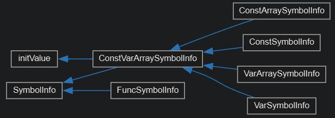
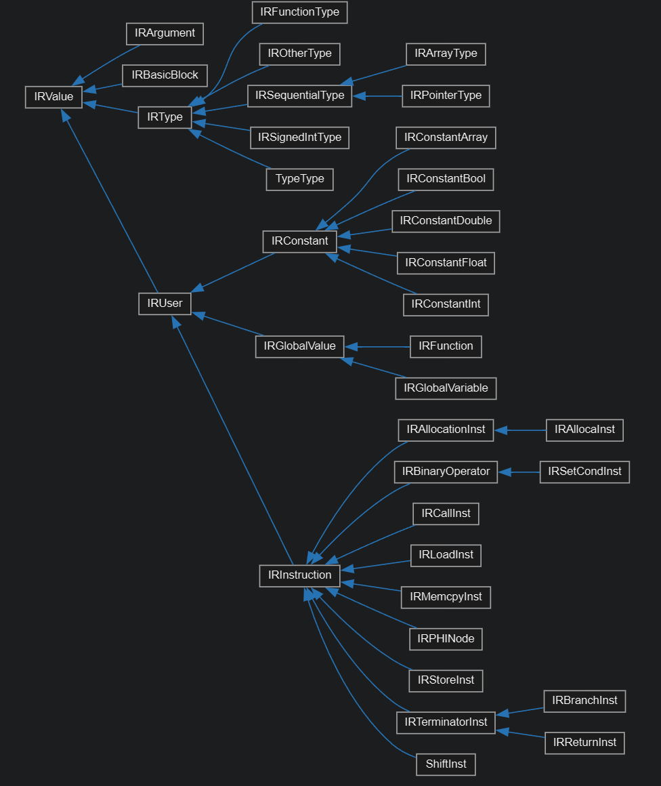
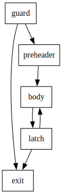
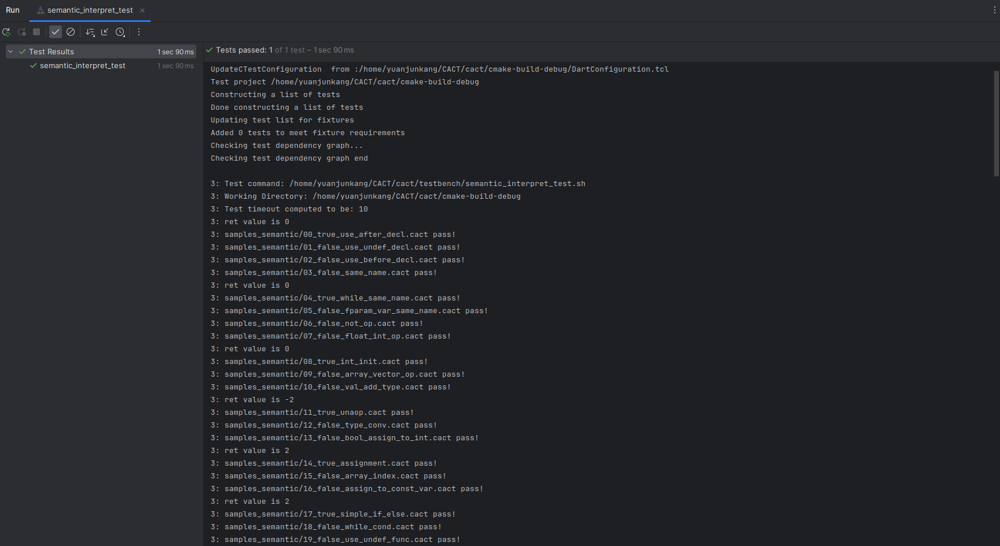
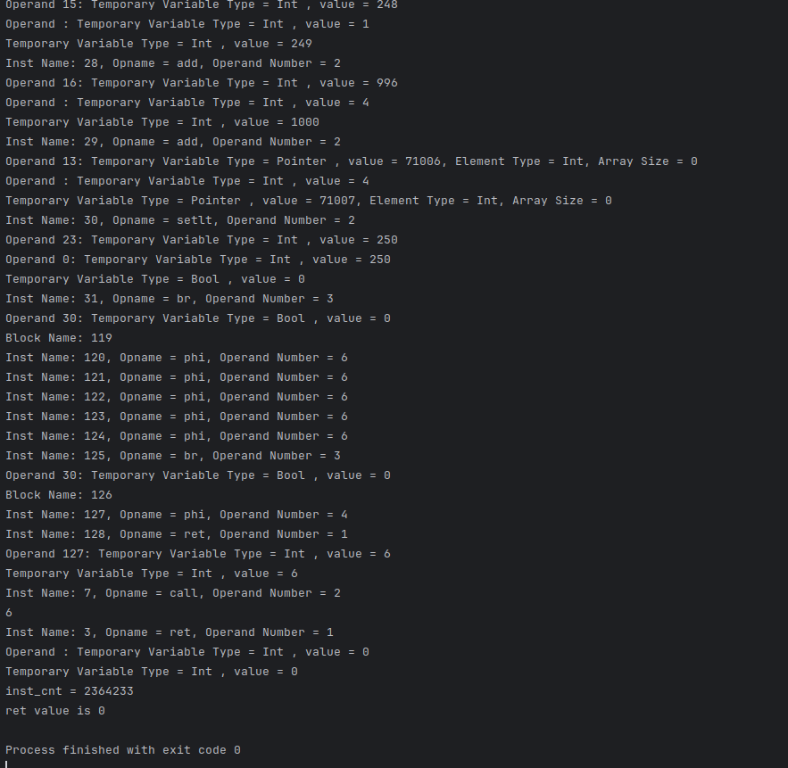

[toc]

# 编译原理研讨课实验PR002实验报告

本次实验代码版本位于 tag：prj2。

## 任务说明

1. 运用属性依赖的相关理论，设计抽象语法树的节点属性
2. 通过在 AST 遍历过程中正确引入代码，实现 CACT 语言的语义分析
3. 检查属性是否合乎语义规范的定义，并报告错误
4. 在语义分析的基础上，生成出自己设计的 IR 实现
5. 完善 IR 的打印输出和解释执行功能，支持 IR 的打印输出，解释执行

## 成员组成

汪铭煜

盛子轩

苑骏康

## 实验设计

### 设计思路

#### 设计编译器的目录结构

> /cact/src/

    SemanticAnalyzer.h
     SemanticAnalyzer.cpp: 语义分析器，负责进行语义的检查，并生成 IR 类
     symbolTable.h
     symbolTable.cpp: 符号表的建立，将符号与构建的 IRValue 建立对应关系
    
    IR/: 生成的 IR 类，并且调用这些类来打印出最终的 IR 代码
    
    Interpreter/:
        TemporaryVariable.h
        TemporaryVariable.cpp 临时变量
        Interpreter.h
        Interpreter.cpp 解释器

### 实验实现

整个实验大致可以分为四个部分：语义检查，IR 设计，IR 类生成，IR 的解释执行。

#### 语义检查

语义检查主要负责在遍历语法树的时候，根据要求的 cact 语言规范检查是否有语义错误，如强制类型转换，数组赋值不正确等等。同时在分析的过程中建立block，block 的符号表，全局块，函数表等，方便后续添加 `IRValue` 进行 IR 类和代码的生成。

##### 符号表类继承关系图



##### symbol 中常量变量等类的大致继承关系

```c++
/***********符号表***********/
class SymbolInfo {
private:
    int line;//表示是第几行声明的变量，函数，或者块
    std::string name;
    IROperand *operand;

protected:
    IRValue* irValue;

	...

    SymbolInfo(const std::string &name, int line);

    ~SymbolInfo(){};
};

class initValue {
protected:
    std::vector<IRConstant*> initValueArray;

public:

    void setInitValue(std::string valueStr, DataType datatype){
        ...
    };

    void setZero(DataType datatype){
        ...
    }

    int getinitValueArraySize() {
        return initValueArray.size();
    }

    std::vector<IRConstant*> getInitValueArray() {//获得某个常量的初始值
        return initValueArray;
    };
};

/***********常量变量数组符号表***********/
class ConstVarArraySymbolInfo : public SymbolInfo, public initValue {
private:
    DataType dataType;
    int global = 0;//代表是否是全局变量

protected:
    IRValue* irinitializer;

public:
    ...

    void setirInitailizer(IRValue* irinitializer) { irinitializer = irinitializer; };
    IRValue* getirInitailizer() { return irinitializer; };

    ConstVarArraySymbolInfo(const std::string &name, int line, DataType dataType, int global);

    ~ConstVarArraySymbolInfo(){};
};


/***********常量符号表***********/
class ConstSymbolInfo : public ConstVarArraySymbolInfo {
public:
    ...

    void setIRValue();

    ConstSymbolInfo(const std::string &name, int line, DataType dataType, int global);

    ~ConstSymbolInfo(){};
};


/***********变量符号表***********/
class VarSymbolInfo : public ConstVarArraySymbolInfo {
public:
    ...

    void setIRValue(IRValue* irvalue) { irValue = irValue; };
    void setIRValue(IRValue::ValueTy vTy, unsigned SymbolCount=0, IRBasicBlock* parent=nullptr, IRValue* IRinitializer=nullptr, IRModule* irmodule=nullptr);

    VarSymbolInfo(const std::string &name, int line, DataType dataType, int global);

    ~VarSymbolInfo(){};
};


/***********常量数组符号表***********/
class ConstArraySymbolInfo : public ConstVarArraySymbolInfo {
private:
    std::vector<int> arraySize;
    int dimension;

public:
   ...

    void setIRValue(IRModule* irmodule=nullptr, unsigned SymbolCount=0, const std::string& FuncName="");

    ConstArraySymbolInfo(const std::string &name, int line, DataType dataType, int global,
                         const std::vector<int> arraySize, int dimension);

    ~ConstArraySymbolInfo(){};
};


/***********变量数组符号表***********/
class VarArraySymbolInfo : public ConstVarArraySymbolInfo {
private:
    std::vector<int> arraySize;
    int dimension;

public:
    ...

    void setIRValue(IRValue* irvalue) { irValue = irValue; };
    void setIRValue(IRValue::ValueTy vTy, unsigned SymbolCount=0, IRBasicBlock* parent=nullptr, IRValue* IRinitializer=nullptr, IRModule* irmodule=nullptr);

    VarArraySymbolInfo(const std::string &name, int line, DataType dataType, int global,
                       const std::vector<int> arraySize, int dimension);

    ~VarArraySymbolInfo(){};
};
```

在符号类中，分为变量，变量数组，常量，常量数组四个子类；

它们继承自 `ConstVarArraySymbolInfo` 类。`ConstVarArraySymbolInfo` 父类有函数 set/getInitliazer，因此每个子类都会在初始的时候通过该函数获得一个初值；

同时它们都继承自 `symbolInfo` 类，因此每个子类都会在类内部维护一个 `irValue` 变量，方便后面 IR 生成可以根据 `irValue` 类直接进行操作；每个子类的`setIRValue` 函数不尽相同，因此不可在父类中进行多态处理。

##### func 符号以及 blockinfo 中的维护的 symboltable，functable 符号函数表

```c++
class FuncSymbolInfo : public SymbolInfo{
private:
    int stack_size = 0;//函数需要栈的大小
    DataType returnType;

    std::vector<SymbolInfo *> paramList;//所有的symbol,将来作为User的IRValue全放在里面
    std::vector<IRType *> IRParams;//IRFunctionType需要的
    std::vector<IRArgument *> IRArgs;//将来作为Value的IRValue全放在里面

    BlockInfo *baseblock;//函数的基本块
public:
	...  

    FuncSymbolInfo(const std::string &name, int line, DataType returnType);

    ~FuncSymbolInfo() {
        for (SymbolInfo *symbol: paramList) { delete symbol; };
    };
};

/***********BlockInfo与Globalblock,block是记录符号表，函数表，块表的基本单位***********/
//对于块而言，这里不再强调它的line
class BlockInfo {
protected:
    BlockInfo *parentBlock;
    FuncSymbolInfo *belongTo = nullptr;//块属于某一个函数

    SymbolTable symbolTable;
    BlockTable blockTable;
    bool returnsign = false;//认定这个块是否满足returnpath都能满足
    //FuncTable funcTable;
    //这里我认为对于一个块而言只需要考虑他的符号表和他的subblock，函数表,对于函数表我的想法是可以做一个全局的，

public:
    BlockInfo *getParentBlock() { return parentBlock; }
    bool getReturnSign() { return returnsign; };
    void setReturnSign(bool returnSign) { returnsign = returnSign; }

    SymbolInfo *lookUpSymbol(std::string symbolName);

    virtual ConstSymbolInfo *addNewConst(const std::string &name, int line, DataType dataType);

    virtual VarSymbolInfo *addNewVar(const std::string &name, int line, DataType dataType);

    virtual ConstArraySymbolInfo *
    addNewConstArray(const std::string &name, int line, DataType dataType, const std::vector<int> arraySize,
                     int dimension);

    virtual VarArraySymbolInfo *
    addNewVarArray(const std::string &name, int line, DataType dataType, const std::vector<int> arraySize,
                   int dimension);

    BlockInfo *addNewBlock();

    BlockInfo *addNewBlock(FuncSymbolInfo *belongTo);
    //两个addNewBlock，主要是看这个block是不是函数
    //如果说是一个函数，那么在new一个新块的时候，自然的这个函数的形参就要加到这个块的符号表里面去

    BlockInfo(BlockInfo *parentBlock);

    BlockInfo(BlockInfo *parentBlock, FuncSymbolInfo *belongTo, const std::vector<SymbolInfo *> &paramList);

    ~BlockInfo(){};
    //如果说是直接隶属于函数的块，则需要记录belongto,同时所有函数的形参都作为这个块的符号表而存在
};
```

`funcsymbol` 与变量常量数组的 `symbol` 大体一致，会在其中存储函数的参数，方便后续对于函数 `IRFunction` 的构造；同时函数中还会维持一个 `blockInfo`，作为这个函数最大的一个 block；

`blockInfo` 中通过 `addNewVar` 等函数来向其中添加变量；同时由于这里的 block 并不是 IR 中的基本块，还需要记录自己的父 block 是谁，因此有 `getParentBlock`与 `addNewBlcok` 函数(向其中添加自己的子 block )；这里的每一个 block 都是一个单独的作用域，当需要进行符号查找的时候，`lookUpSymbol` 函数会从当前的block 出发向上一层层查找，直到找到变量，通过这种方式来解决重名变量作用域的问题。

##### visitConstantInitValue()

```c++
std::any SemanticAnalyzer::visitConstantInitValue(CACTParser::ConstantInitValueContext *context) {
    bool zero_dim;
    bool single_dim;  // 确定这个数组的写法，是一维的写法还是多维的写法，由此确定是否需要向下递归

    // 这里有一点，对于嵌套括号的写法，一定要越过single_dim这一层

    /* clang-format off */
    zero_dim = (context->constantExpression() != nullptr) && context->arraySize.empty();
    single_dim = !zero_dim &&
                 (context->dimension >= 1) && (context->LeftBrace() != nullptr && context->RightBrace() != nullptr) &&
                 //确定是一个数组(对应左侧与右侧)(任何数组都可以采用一维的写法)
                 (context->dimension == context->arraySize.size()) &&                        //确定是第一层进入
                 (context->constantInitValue().empty() ||
                  context->constantInitValue().front()->constantExpression() != nullptr);
    //往下多看一层，如果发现已经是constExpression了那么就代表是一维数组(或者啥都没有就是一对大括号);
    /* clang-format on */

    int arraySize = 0;

    /******single_dim直接终止递归，否则往下递归******/
    if (zero_dim) {
        context->constantExpression()->dataType = context->dataType;
        this->visit(context->constantExpression());
        currentSymbol->setInitValue(context->constantExpression()->getText(),
                                    context->constantExpression()->dataType);
    } else if (single_dim) {
        // 遍历每一个一维元素，直接压栈即可
        arraySize = std::accumulate(context->arraySize.begin(), context->arraySize.end(), 1,
                                    std::multiplies<>());

        // 如果有元素，先尝试压栈
        if (!context->constantInitValue().empty()) {  // 这个vector中没有元素
            for (auto constantInitValue: context->constantInitValue()) {
                constantInitValue->dataType = context->dataType;
                constantInitValue->dimension = context->dimension;

                this->visit(constantInitValue);
            }
        }

        // 补零
        for (int i = currentSymbol->getinitValueArraySize(); i < arraySize; i++) {
            currentSymbol->setZero(context->dataType);
        }
    } else {
        int subArraySize = 0;
        int currentSize = 0;

        /******进行array的参数一致性检查******/
        // type MUST BE array

        /******constantExpression不为空已经到底，arraySize还没empty，真实的数组(相比arraySize)少了维度******/
        if (context->constantExpression() != nullptr) {
            ErrorHandler::printErrorContext(context, "less brace for InitValue");
            throw std::runtime_error("Semantic analysis failed at " + std::string(__FILE__) + ":" +
                                     std::to_string(__LINE__));
        }

        /******constantExpression为空还没到底，arraySize已经empty，真实的数组(相比arraySize)多了维度******/
        if (context->arraySize.empty()) {
            ErrorHandler::printErrorContext(context, "more brace for InitValue");
            throw std::runtime_error("Semantic analysis failed at " + std::string(__FILE__) + ":" +
                                     std::to_string(__LINE__));
        }

        /******constantInitValue数量得和这一层的array属性值相同******/
        /******如果是最下一层一维的，可以选择不相同然后补零*****/
        if ((context->arraySize.size() != 1) &&
            (context->constantInitValue().size() != context->arraySize.front())) {
            ErrorHandler::printErrorContext(context, "Error number for InitValue");
            throw std::runtime_error("Semantic analysis failed at " + std::string(__FILE__) + ":" +
                                     std::to_string(__LINE__));
        }

        /******计算arraySize和subArraySize******/
        arraySize = std::accumulate(context->arraySize.begin(), context->arraySize.end(), 1,
                                    std::multiplies<>());
        subArraySize = arraySize / context->arraySize.front();

        for (auto constantInitValue: context->constantInitValue()) {
            // 更新下一级的locals
            constantInitValue->dataType = context->dataType;
            for (auto i = context->arraySize.begin() + 1; i < context->arraySize.end(); ++i) {
                constantInitValue->arraySize.push_back(*i);
            }
            constantInitValue->dimension = context->dimension;
            this->visit(constantInitValue);

            // 上面已经访问了一个子数组，然后将所有的空缺部位全部填上0
            currentSize +=
                    subArraySize;  // 这里与上面参数一致性的第三个判断是对应的；当是一维的时候这里可以选择补零，其他情况均不考虑
            for (int i = currentSymbol->getinitValueArraySize(); i < currentSize; i++) {
                currentSymbol->setZero(context->dataType);
            }
        }
    }

    return {};
}
```

`visitConstantInitValue()` 主要完成每一个 const 或 var 的初始赋值。根据维数判断是数组还是原始的变量或常量，并且最终将所有的数组在根据 CACT 语言规范补0 后变成一维数组。

如果是常量或变量，并且判断 zero_dim 为 true，符合语义规范，则直接 `setInitValue`，将初始值设置为其 `IRValue`；

如果是数组，根据 CACT 语言规范。要么采取直接将多维数组转变为一维数组写入的形式，要么根据维数嵌套大括号。如果符合这两种规范其一，则语义检查通过；如果嵌套大括号中间有空，则采取添0来进行处理。在符合语义规范的情况下，通过 `setInitValue` 来对数组赋初值。

##### visitVariableDeclaration()

```c++
std::any SemanticAnalyzer::visitVariableDefinition(CACTParser::VariableDefinitionContext *context) {
    size_t line = context->Identifier()->getSymbol()->getLine();
    for (auto size: context->IntegerConstant()) {
        context->arraySize.push_back(stoi(size->getText()));
    }
    size_t dimension = context->arraySize.size();
    std::string name = context->Identifier()->getText();
    /******先构建玩currentsymbol，再去往下访问******/
    if (dimension == 0) {
        currentSymbol = this->currentBlock->addNewVar(name, line, context->dataType);
    } else {
        currentSymbol = this->currentBlock->addNewVarArray(name, line, context->dataType,
                                                           context->arraySize, dimension);
    }

    if (context->constantInitValue() != nullptr) {
        context->constantInitValue()->dataType = context->dataType;
        context->constantInitValue()->arraySize = context->arraySize;
        context->constantInitValue()->dimension = dimension;  // 这里必须得传进维数，确定递归层数
        this->visit(context->constantInitValue());
    } else {
        /*如果没有显式初始化，那么通过一个循环把所有相关初始化为0的数全部压进去*/
        unsigned loop;
        if (context->arraySize.empty()) {
            loop = 1;
        } else {
            loop = std::accumulate(context->arraySize.begin(), context->arraySize.end(), 1,
                                   std::multiplies());
        }

        for (int i = 0; i < loop; i++) {
            currentSymbol->setZero(context->dataType);  // 如果没有显式初始化
        }
    }
    // return std::make_tuple(name, context->arraySize, dimension, line);

	...
}
```

`visitVariableDeclaration()` 负责对于变量在进入 `initValue` 赋初值之前进行维数等判断的预处理。首先函数会根据是变量还是变量数组构建一个符号，然后将这个符号传进 `visitinitValue()` 函数来进行构建，

同时在符号构建完毕后还会根据将当前的符号加入对应 block 的符号表中，方便后续的作用域检查；设置变量的 `irinitValueArray` 方便后面的 `IRValue` 的赋初值。

##### visitFunctionDefinition()

```c++
std::any SemanticAnalyzer::visitFunctionDefinition(CACTParser::FunctionDefinitionContext *context) {
    std::string returnTypeText = context->functionType()->getText();
    DataType returnType;
    returnType = Utils::stot(returnTypeText);

    context->thisfuncinfo =
            globalBlock->addNewFunc(context->Identifier()->getText(),
                                    context->Identifier()->getSymbol()->getLine(), returnType);
    // 全局块中的函数表添加，同时获得这个funcdefinition的funcsymbolinfo，为将来的blockinfo初始化做准备

    currentFunc = context->thisfuncinfo;  // 更新currentFunc
    /******先构建一个basicblock,后续对他的parent进行赋值******/
    IRBasicBlock *irfirstbasicblock;
    irfirstbasicblock = new IRBasicBlock("0");

    /******构建了paramlist,IRArgs(缺少母函数)，IRparams******/
    if (context->functionFParams() != nullptr) {
        if (context->Identifier()->getText() == std::string("main")) {
            ErrorHandler::printErrorContext(
                    context,
                    "main function must be without params");  // main函数不能带有参数
            throw std::runtime_error("Semantic analysis failed at " + std::string(__FILE__) + ":" +
                                     std::to_string(__LINE__));
        } else {
            context->functionFParams()->thisfuncinfo = context->thisfuncinfo;
            context->functionFParams()->irbasicblock = irfirstbasicblock;
            this->visit(
                    context
                            ->functionFParams());  // 先去访问参数，在将参数都访问完之后可以获得一个完整的函数定义，再去定义blockinfo
            // 等待下面的参数层完善这个函数
        }
    }

    ...

    return {nullptr};
}
```

`visitFunctionDefinition()` 在语义检查的过程中主要负责检查是否为 main 函数(如果为 main 则不能有参数)，以及如果函数返回类型不为 void，是否有返回值。在满足上述语义规范的情况下，在函数表中添加该函数，并且给每个块设置母函数。

##### visitFunctionFParam()

```c++
std::any SemanticAnalyzer::visitFunctionFParam(CACTParser::FunctionFParamContext *context) {
    std::string basicTypeText = context->basicType()->getText();
    DataType basicType;
    basicType = Utils::stot(basicTypeText);
    SymbolInfo *symbolInfo;
    IRArgument *irarg;
    IRType *irElType;
    IRType *irType;

    int dimension;
    dimension = context->LeftBracket().size();  // 计算维数

    switch (basicType) {
        case BOOL:
            irElType = const_cast<IRType *>(IRType::getPrimitiveType(IRType::BoolTyID));
            break;
        case INT:
            irElType = const_cast<IRType *>(IRType::getPrimitiveType(IRType::IntTyID));
            break;
        case FLOAT:
            irElType = const_cast<IRType *>(IRType::getPrimitiveType(IRType::FloatTyID));
            break;
        case DOUBLE:
            irElType = const_cast<IRType *>(IRType::getPrimitiveType(IRType::DoubleTyID));
            break;
    }

    /******new一个basicblock往里面添加******/

    if (!dimension) {
        symbolInfo = context->thisfuncinfo->addParamVar(
                context->Identifier()->getText(), context->Identifier()->getSymbol()->getLine(),
                basicType);

        irType = irElType;
        // 变量设置IRValue
        // dynamic_cast<VarSymbolInfo*>(symbolInfo)->setIRValue(IRValue::InstructionVal, basicType,
        //                                        context->beforeFuncCount, context->irbasicblock);
    } else {
        int valid_size;  // 标记了数字的个数//第一维可能标记为0
        valid_size = context->IntegerConstant().size();
        std::vector<int> param_array;

        if (valid_size == dimension) {
            for (auto integetconstant: context->IntegerConstant()) {
                param_array.push_back(stoi(integetconstant->getText()));
            }
        } else if (valid_size == (dimension - 1)) {
            /******如果第一维是空的话那么给0******/
            param_array.push_back(0);
            for (auto integetconstant: context->IntegerConstant()) {
                param_array.push_back(stoi(integetconstant->getText()));
            }
        } else {
            ErrorHandler::printErrorContext(context, "array dimension error");
            throw std::runtime_error("Semantic analysis failed at " + std::string(__FILE__) + ":" +
                                     std::to_string(__LINE__));
        }  // 分析得到paramlist

        symbolInfo = context->thisfuncinfo->addParamArray(
                context->Identifier()->getText(), context->Identifier()->getSymbol()->getLine(),
                basicType, param_array, dimension);

        //unsigned arraysize;  // 记录这个paramarray有多大
        //arraysize = std::accumulate(param_array.begin(), param_array.end(), 1, std::multiplies());
        irType = new IRPointerType(irElType);

        // 变量设置IRValue
        // dynamic_cast<VarArraySymbolInfo*>(symbolInfo)->setIRValue(IRValue::InstructionVal,
        // basicType,
        //                                                 context->beforeFuncCount,
        //                                                 context->irbasicblock);
    }

    /******与paramlist同步构建IRargs与IRparams******/
    irarg = new IRArgument(irType, std::to_string(context->beforeFuncCount));
    currentFunc->getIRArgs().push_back(irarg);
    currentFunc->getIRParams().push_back(irType);
    /******将新加入参数的类型加入到当前函数中******/
    // currentFunc->getIRParams().push_back(symbolInfo->getIRValue()->getType());

    return {nullptr};
}
```

在函数参数的语义检查中，最重要的部分在于如果传参是数组需要考虑维数是否正确，同时通过 `paramlist` 的构建获得该函数的参数列表，见函数的参数列表计入这个函数对应的 block 的符号表中；同时同步构建 IRargs 与 IRparams ，在将来的任务中通过参数列表来构建函数的 IRFunc。

##### 类型检查

由于 cact 不支持类型转换，所以每一次运算都需要检查类型是否相等，这里以赋值、加法、和单目运算的检查为例子。

##### visitExpressionStatement()

```c++
std::any SemanticAnalyzer::visitExpressionStatement(
        CACTParser::ExpressionStatementContext *context) {
    if (context->lValue() != nullptr) {
        auto lValue = std::any_cast<ReturnValue>(this->visit(context->lValue()));
        auto expression = std::any_cast<ReturnValue>(this->visit(context->expression()));
        if (lValue.getDataType() != expression.getDataType()) {
            ErrorHandler::printErrorContext(context, "data type error");
            throw std::runtime_error("Semantic analysis failed at " + std::string(__FILE__) + ":" +
                                     std::to_string(__LINE__));
        }
        if (lValue.getDimension() != 0) {
            ErrorHandler::printErrorContext(context->lValue(), "is array");
            throw std::runtime_error("Semantic analysis failed at " + std::string(__FILE__) + ":" +
                                     std::to_string(__LINE__));
        }
        if (expression.getDimension() != 0) {
            ErrorHandler::printErrorContext(context->expression(), "is array");
            throw std::runtime_error("Semantic analysis failed at " + std::string(__FILE__) + ":" +
                                     std::to_string(__LINE__));
        }
        if (lValue.getSymbolType() == SymbolType::NUM ||
            lValue.getSymbolType() == SymbolType::CONST_ARRAY ||
            lValue.getSymbolType() == SymbolType::CONST) {
            ErrorHandler::printErrorContext(context->lValue(), "is constant");
            throw std::runtime_error("Semantic analysis failed at " + std::string(__FILE__) + ":" +
                                     std::to_string(__LINE__));
        }
        return {};
    } else {
        if (context->expression()) {
            visit(context->expression());
        }
        return {};
    }
}
```

对于赋值运算，检查 lvalue 和 expression 的类型是否相同。同时，不允许整个数组的赋值，也不允许对常量进行赋值。

##### visitAdditiveExpression()

```c++
std::any SemanticAnalyzer::visitAdditiveExpression(CACTParser::AdditiveExpressionContext *context) {
    std::vector<ReturnValue> expList;
    for (auto multiplicativeExpression: context->multiplicativeExpression()) {
        expList.push_back(std::any_cast<ReturnValue>(this->visit(multiplicativeExpression)));
    }

    if (expList.size() > 1) {
        for (int i = 0; i < expList.size(); ++i) {
            if (expList[i].getDataType() != DataType::INT &&
                expList[i].getDataType() != DataType::DOUBLE &&
                expList[i].getDataType() != DataType::FLOAT) {
                ErrorHandler::printErrorContext(
                        context->multiplicativeExpression(i),
                        "is " + Utils::ttos(expList[i].getDataType()) + ", error data type");
                throw std::runtime_error("Semantic analysis failed at " + std::string(__FILE__) +
                                         ":" + std::to_string(__LINE__));
            }
            if (expList[i].getDimension() != 0) {
                ErrorHandler::printErrorContext(context->multiplicativeExpression(i), "is array");
                throw std::runtime_error("Semantic analysis failed at " + std::string(__FILE__) +
                                         ":" + std::to_string(__LINE__));
            }
        }
        for (int i = 1; i < expList.size(); ++i) {
            if (expList[i - 1].getDataType() != expList[i].getDataType()) {
                ErrorHandler::printErrorContext(context->multiplicativeExpression(i - 1),
                                                "is " + Utils::ttos(expList[i - 1].getDataType()));
                ErrorHandler::printErrorContext(context->multiplicativeExpression(i),
                                                "is " + Utils::ttos(expList[i].getDataType()));
                throw std::runtime_error("Semantic analysis failed at " + std::string(__FILE__) +
                                         ":" + std::to_string(__LINE__));
            }
        }
    }
    return expList[0];
}
```

如果加法的式子里只有一个数，那么就不需要检查类型，因为不存在加法。否则，式子中的数必须是 int、double、float 类型，不能是数组，并且所有数的类型要相同。对于其他运算符号的检查逻辑和加法是相通的。

##### visitUnaryExpression()

```c++
std::any SemanticAnalyzer::visitUnaryExpression(CACTParser::UnaryExpressionContext *context) {
    DataType dataType;
    std::vector<int> arraySize;
    if (context->primaryExpression() != nullptr) {  // primaryExpression
        return visitChildren(context);
    } else if (context->unaryOperator() != nullptr) {  // unaryOperator unaryExpression
        auto unaryExpression = std::any_cast<ReturnValue>(this->visit(context->unaryExpression()));
        dataType = unaryExpression.getDataType();
        if (unaryExpression.getDimension() != 0) {
            ErrorHandler::printErrorContext(context->unaryExpression(), "is array");
            throw std::runtime_error("Semantic analysis failed at " + std::string(__FILE__) + ":" +
                                     std::to_string(__LINE__));
        }
        if (context->unaryOperator()->getText() == "!") {
            if (dataType != DataType::BOOL) {
                ErrorHandler::printErrorContext(
                        context->unaryExpression(),
                        "Error data type, expect " + Utils::ttos(DataType::BOOL));
                throw std::runtime_error("Semantic analysis failed at " + std::string(__FILE__) +
                                         ":" + std::to_string(__LINE__));
            }
        } else {
            if (dataType != DataType::DOUBLE && dataType != DataType::FLOAT &&
                dataType != DataType::INT) {
                ErrorHandler::printErrorContext(
                        context->unaryExpression(),
                        "Error data type, expect " + Utils::ttos(DataType::DOUBLE) + "/" +
                        Utils::ttos(DataType::FLOAT) + "/" + Utils::ttos(DataType::INT));
                throw std::runtime_error("Semantic analysis failed at " + std::string(__FILE__) +
                                         ":" + std::to_string(__LINE__));
            }
        }
        return unaryExpression;
    } else {  // function
        auto func = globalBlock->lookUpFunc(context->Identifier()->getText());
        if (func == nullptr) {
            ErrorHandler::printErrorContext(context, "use of undeclared function");
            throw std::runtime_error("Semantic analysis failed at " + std::string(__FILE__) + ":" +
                                     std::to_string(__LINE__));
        }
        if (context->functionRParams() != nullptr) {
            context->functionRParams()->func = func;
            this->visit(context->functionRParams());
        } else {
            if (func->getparamNum() != 0) {
                ErrorHandler::printErrorContext(context, "Too few arguments");
                throw std::runtime_error("Semantic analysis failed at " + std::string(__FILE__) +
                                         ":" + std::to_string(__LINE__));
            }
        }
        return ReturnValue(func->getDataType(), 0, std::vector<int>(), func->getSymbolType());
    }
}

```

三种情况，primaryExpression 直接向下递归，无需检查。如果有单目运算符，那么我们需要检查运算符和操作数的类型是否匹配。如果是函数，首先需要检查函数是否在符号表中存在，然后依次检查参数传入的个数，各个参数的类型是否正确。

#### IR 设计

有关IR的设计我们一直非常纠结，因为如果IR设计的不好对于后续的优化会产生负面影响，因此我们最终决定参考成熟的IR设计——llvm IR。为了简单起见，我们参考了 llvm 1.0.0 的 IR 设计。

##### 虚拟寄存器和内存

```llvm
@global_data i32 0              ; 全局变量以@开头
def i32 main() {                ; 函数定义也以@开头
    %1 = alloca i32             ; 局部变量以%开头
    %2 = load i32, ptr @global_data
    store i32 %2, ptr %1
}
```

在上面的 IR 中，`@global_data` 和 `%1` 分别是指向全局变量和栈上局部变量的指针。所有以 % 开头的符号代表一个虚拟寄存器。llvm 假设虚拟寄存器无限多。

##### 指令类型

###### 二元运算

加减乘除，取余，比较，与，或，异或，移位运算支持。

###### 控制语句

```
; 条件跳转
br %compare_result, label %A, label %B // true跳A, false跳B
; 无条件跳转
br label %start
; 函数返回
ret void
ret int %3
```

##### SSA

静态单赋值（SSA）在 llvm 中 IR 的体现为每个虚拟寄存器只有一次赋值点。这种规定会给后续的优化带来很大的便利，但是同时也引来了麻烦，比如下面的程序。

```c++
a = 0;
if (b > 0) 
    a = 1;
else 
    a = 2;
```

如果按照 c 语言的思路，我们会这样翻译

```llvm
	%a = 0
	%1 = icmp setgt %b 0
	br %1 label %true label %false
%true:
	%a = 1
	br label %next
%false:
	%a = 2
	br label %next
%next:
```

但这样是错误的，`%a` 被赋值了 3 次，这不符合 SSA 的要求。如何修改？有两种方法。

###### 方法 1：load/store

llvm 的 SSA 仅要求对虚拟寄存器的赋值是单赋值，所以我们可以用内存开后门。

```
	%a = alloc int*
	%b = alloc int*
	store 0 %a
	%1 = load int %b
	%2 = icmp setgt %1 0
	br %2 label %true label %false
%true:
	store 1 %a
	br label %next
%false:
	store 2 %a
	br label %next
%next:
```

通过 alloc 在栈上为变量申请空间，通过多次 store 完成对变量的赋值。这样就使得代码符合 SSA 的要求。但是，这种做法使得每次变量的使用都需要访问内存。代码的性能非常差。

###### 方法2：phi

我们引入 phi 语句。

```
	%a1 = 0
	%1 = icmp setgt %b1 0
	br %1 label %true label %false
%true:
	%a2 = 1
	br label %next
%false:
	%a3 = 2
	br label %next
%next:
	%a4 = phi [%a2 %true] [%a3 %false] ; 如果从%true跳转过来，值就是%a2, 如果从%false跳转过来，值就是%a3
```

上面代码中，`%a4` 使用 phi 赋值，如果上一个基本块是 `%true`，值是%a2，如果上一个基本块是 `%false`，值是`%a3`。`%a1`，`%a2`，`%a3`，`%a4` 是 a 的值。可以看出，引入 phi 语句让变量 a 的地址消失了，取而代之的是 a 的值。

方法 1 代码生成简单，但效率低，方法 2 代码生成困难但效率高，如何平衡？前端使用方法 1 生成 SSA 形式的代码，优化器通过 mem2reg pass 将前端生成的代码转换成等效的方法 2 形式的代码。

##### IR 类继承关系图



从上面的类继承关系图可以看出，所有的类都继承自 `IRValue` 这个基类。这是 LLVM IR 中非常基础的基类。

##### IRArgument

```c++
class IRArgument : public IRValue {
    IRFunction *Parent = nullptr;

public:
    ...
};
```

``IRArgument`` 是函数形参，其有一个 `Parent` 指针指向使用其的函数。

##### IRBasicBlock

```c++
class IRBasicBlock : public IRValue {
private:
    std::vector<IRInstruction *> InstList;

    IRFunction *parent;

    ...
public:
	...
    IRTerminatorInst *getTerminator();//获得终止指令
    std::vector<IRInstruction *> &getInstList() { return InstList; }
	...
};

```

``IRBasicBlock`` 是基本块，其有一个 `Parent` 指针指向其属于的函数。`InstList` 用于存储基本块中的指令。

一个基本块由一个 label 开始（可以不显示的声明），中间为一系列指令，到一个控制语句结束（必须有）。

```llvm
%A:
%x1 = add i32 %y, 1
br label %C
```

这样规定基本块的组成可以避免前端在生成 IR 的时候不需要考虑多余 label 的事情，使得前端的编写更加简单。同时在构建 IR 代码时顺便构建了控制流图，为后续优化提供方便。

##### IRGlobalValue, IRGlobalVariable, IRFunction

```c++
class IRGlobalValue : public IRUser {
protected:
    IRGlobalValue(IRType *Ty, ValueTy vty, LinkageTypes linkage,
                  const std::string &name = "")
        : IRUser(Ty, vty, name), Linkage(linkage), Parent(nullptr) {}
    LinkageTypes Linkage;
    IRModule *Parent;

public:
    ~IRGlobalValue() = default;

    /******注意这里的强制转换类型，对于IRGlobalValue，全部将type类型强制转换为pointertype******/
    inline IRPointerType *getType() const {
        return (IRPointerType *) IRUser::getType();
    }
    /******提供一个不强制转换类型的函数******/
    inline IRType *getOriginType() const {
        return IRUser::getType();
    }

	...

    /******获得最大块******/
    inline IRModule *getParent() { return Parent; }

};

class IRGlobalVariable : public IRGlobalValue {
    void setParent(IRModule *parent);

    bool isConstantGlobal;

public:
    IRGlobalVariable(IRType *Ty, bool isConstant, LinkageTypes Linkage,
                     IRConstant *Initializer = nullptr, const std::string &Name = "",
                     IRModule *Parent = nullptr);

    /******全局变量的初始化******/
    inline bool hasInitializer() const { return !Operands.empty(); }
    inline IRConstant *getInitializer() const {
        assert(hasInitializer() && "GV doesn't have initializer!");
        return (IRConstant *) Operands[0].get();
    }
    inline void setInitializer(IRConstant *CPV) {
        if (CPV == nullptr) {
            if (hasInitializer()) Operands.pop_back();
        } else {
            if (!hasInitializer()) Operands.emplace_back(nullptr, this);
            Operands[0] = (IRValue *) CPV;
        }
    }

    /******判断是不是一个常量，但是我们都会把这个常量直接当作立即数使用，故无用******/
    bool isConstant() const { return isConstantGlobal; }

    /******全局变量的print******/
    void printPrefixName(std::ostream &OS) const;
    void print(std::ostream &OS) const override;

};

class IRFunction : public IRGlobalValue {
public:
    enum FuncTy{
        Declared,
        UnDeclared,
    };

private:
    std::vector<IRArgument *> ArgumentList;
    std::vector<IRBasicBlock *> BasicBlocks;
    IRModule *Parent;
    unsigned IRSymbolCount = 0;
    FuncTy fTy;

    void setParent(IRModule *parent);

public:
    IRFunction(IRFunctionType *Ty, IRGlobalValue::LinkageTypes Linkage, 
            const std::string &N, IRModule *M, FuncTy fty);
    ~IRFunction() = default;

//    const IRType *getReturnType() const;            // Return the type of the ret val
    const FuncTy  getFuntTy() { return fTy; };

    /******IRFunction继承IRvalue，获得它的IRtype指针******/
    IRFunctionType *getFunctionType() const;        // Return the FunctionType for me

    /******函数的arg和basicblock******/
    std::vector<IRArgument *> &getArgumentList() { return ArgumentList; }
    std::vector<IRBasicBlock *> &getBasicBlockList() { return BasicBlocks; }

    void addArgument(IRArgument * arg);
    void addBasicBlock(IRBasicBlock * block);

    IRBasicBlock *getEntryBlock() { return BasicBlocks.front(); }

    /******IRFunction的print方法******/
    void printPrefixName(std::ostream &OS) const override;
    void Funcprint(std::ostream &OS) const;
    void print(std::ostream &OS) const override;

    /******每一个函数维护自己这个函数内记录了多少个IRSymbol******/
    void addCount(){ IRSymbolCount++; }
    unsigned getCount(){ return IRSymbolCount; }
    void setCount(unsigned Count){ IRSymbolCount = Count; }
};

```

`IRGlobalVariable` 与 `IRFunction` 都继承了 `IRGlobalValue` 类，作为全局的的变量或者函数

* `IRGlobalValue` 类提供了一个 `getParent()` 接口，由于 `IRGlobalVariable` 与 `IRFunction` 都是全局的，因此可以通过他们直接获得全局的 `IRModule`；
* `IRGlobalVariable` 类由于是全局变量，因此提供了 `initializer` 相关函数来对这些全局变量进行初始化；
* `IRFunction` 类在内部维护了函数参数列表和 basicblock 列表，每一个函数在经过语义分析之后，会将其中的控制流语句全部摊平成一个个的 basicblock，`IRFunction` 提供了访问这些基本块的接口；同时 `IRFunction` 内部拥有 print 相关的函数来进行打印最终生成的 IR 代码；`IRFunction` 内部还维护了一个 `count` 变量，用来最终生成 IR 代码中的变量进行命名。

##### IRType

``IRType`` 是 IR 的类型系统，其实现较为巧妙，下面用较大的篇幅来对其进行介绍：

```c++
class IRType : public IRValue {
public:
    enum PrimitiveID {
        VoidTyID = 0,
        BoolTyID,//  0, 1: Basics...
        IntTyID, //  2: 32 bit types...
        FloatTyID,
        DoubleTyID,// 3, 4: Floating point types...

        TypeTyID, // 5   : Type definitions
        LabelTyID,// 6   : Labels...

        // Derived types... see DerivedTypes.h file...
        FunctionTyID,
        ArrayTyID,
        PointerTyID,

        NumPrimitiveIDs,// Must remain as last defined ID
        FirstDerivedTyID = FunctionTyID,
    };

private:
    PrimitiveID ID;

protected:
    IRType(const std::string &Name, IRType::PrimitiveID id);

    ~IRType() override = default;

public:
    void print(std::ostream &OS) const override;

    inline PrimitiveID getPrimitiveID() const { return ID; }

    /**
     * Return true if the value is holdable in a register
     * @return bool
     */
    inline bool isFirstClassType() const {
        return isPrimitiveType() || ID == PointerTyID;
    }

    /**
     *
     * @return basic size of this type if it is a primitive type, zero if the type
     * dose not have a size or is not a primitive type
     */
    unsigned getPrimitiveSize() const;

    static const IRType *getPrimitiveType(PrimitiveID IDNumber);

    static IRType *VoidTy, *BoolTy;
    static IRType *IntTy;
    static IRType *FloatTy, *DoubleTy;

    static IRType *TypeTy, *LabelTy;
};

class IRSequentialType : public IRType {
protected:
    IRType *elementType;
    IRSequentialType(PrimitiveID TID, IRType *ElType)
        : IRType("", TID) {
        elementType = ElType;
    }

public:
    inline IRType *getElementType() const { return elementType; }
    virtual const IRType *getTypeAtIndex(const IRValue *V) const {
        return elementType;
    }
    virtual bool indexValid(const IRValue *V) const {
        return V->getType() == IRType::IntTy;// Must be a 'int' index
    }
    virtual const IRType *getIndexType() const { return IRType::IntTy; }

    void IRpointerPrintAlign(std::ostream &OS);
};
```

* 在每一个 `IRValue` 类中都会维护一个 `IRType` 类来表明这个 `IRValue` 的类型，如 `IRFunctionType`；但是对于多重指针的情况，单纯的只用一个 `IRType` 自然不能表示出所有可能的指针情况，因此在 `IRSequentialType` 中有一个 `getElementType` 函数来间接地达到指针类型的效果；
* 如果当前的 `IRValue` 只是单纯的函数类型或者 bool，int 类型等，那么 `IRType` 将是简单的 `primitiveType` 类型；否则将属于 `DerivedType`；在 `IRType` 类中有专门的 getPrimitiveID 等一系列函数来判断是否属于 primitiveType；
* 如果是 DerivedType 类型，进一步的是指针类型或者数组类型，那么在 SequentialType 中将提供 getElementType 函数来进行多层嵌套，即每一层 getElementType 会返回当前指针所指向的类型(或数组中包含的元素类型)，最终获得底层的 primitiveType 类型；
* 在 `IRType` 中由于底层的 primitiveType 类型是一个会被多次复用的类，因此将其做成了静态的对象放在了 `IRType` 类中，每次不用 new 一个新的对象，直接返回静态对象的指针即可。

##### IRValue 和 IRUser

``IRValue`` 是最基础的基类，继承 ``IRValue`` 的子类表示其结果可以被其他类使用。继承 ``IRUser`` 的子类表示其会使用一个或多个 ``IRValue``。那么如何维护这样的关系？llvm 引入了 use-def 链和 def-use 链这两个概念。use-def 链表示一个 ``IRUser`` 使用的 ``IRValue`` 列表。def-use 链表示一个 ``IRValue`` 的 ``IRUser`` 列表。同时还定义了 ``IRUse`` 类，作为上述关系的边。

```c++
class IRValue {
private:
    ...
    std::vector<IRUse *> Uses;
public:
	...
    /******对IRValue的Uses进行操作******/
    /**
     * add Use in Uses. It should only be used by the Use class
     * @param U
     */
    void addUse(IRUse &U) {
        Uses.push_back(&U);
    }
    /**
     * delete all Use* in Uses which equals &U. It should only be used by ths Use class
     * @param U
     */
    void killUse(IRUse &U) {
        auto ptr = std::find(Uses.begin(), Uses.end(), &U);
        Uses.erase(ptr);
    }
};
```

```c++
class IRUser : public IRValue {
protected:
    std::vector<IRUse> Operands;
public:
    ...
    /******根据index获得偏移******/
    inline IRValue *getOperand(unsigned i) const {
        assert(i < Operands.size() && "getOperand() out of range!");
        return Operands[i];
    }

    inline void setOperand(unsigned i, IRValue *Val) {
        assert(i < Operands.size() && "setOperand() out of range!");
        Operands[i] = Val;
    }

    /******获得操作数个数******/
    inline unsigned getNumOperands() const { return Operands.size(); }

    void dropAllReferences() {
        Operands.clear();
    }
};
```

```c++
class IRUse {
    IRValue *val;
    IRUser *user;

public:
	void set(IRValue *Val);
    ...
};

void IRUse::set(IRValue *Val) {
    if (val)
        val->killUse(*this);
    val = Val;
    if (Val)
        Val->addUse(*this);
}
```

``IRValue`` 中 ``Uses`` 记录了使用这个类的 ``IRUser`` 列表，对应 def-use 链。

``IRUser`` 中 ``Operands`` 记录了这个类使用的 ``IRValue`` 列表，对应 use-def 链。

``IRUse`` 中的 ``val`` 和 ``user`` 记录了这条边的两个节点。联系了 ``IRValue`` 和 ``IRUser``。 同时 ``IRUse`` 类中设计了 ``set`` 方法，用于修改边的连接关系，并且自动修改 def-use 链和 use-def 链。

``IRUser`` 被三个子类继承，``IRConstant``、``IRGlobalValue`` 和 ``IRInstruction`` 继承，分别表示常数，全局量（包括函数和全局变量）和指令。

这样的设计可以在生成 IR 代码的时候顺便构建出 DAG。为后续的优化提供方便。

##### IRAllocaInst

在 ir 中，全局变量用 `IRGlobalVariable` 表示，局部变量我们将其放到栈上，用 `IRAllocaInst` 表示，该指令的 `IRType` 是 `IRPointerType` 表示一个指向栈上的指针，配合 `load` 和 `store` 对变量进行操作。

##### 常量的表示

在 IR 中，对于单个常量变量，如果其被使用，我们用其值当作立即数放入指令中。对于常量数组，为了方便起见我们将其存储为一个全局数组。

#### IR 类生成

##### 变量常量对应 IR 类的生成

```c++
void VarSymbolInfo::setIRValue(IRValue::ValueTy vTy, unsigned SymbolCount, IRBasicBlock* parent, IRValue* IRinitializer, IRModule* irmodule){

    /******对一个var而言,所有显式和非显式的初始化全部都在外面做好之后压到initvaluearray里面******/
    if(!initValueArray.empty()){
        irinitializer = initValueArray[0];
    }else{
        irinitializer = IRinitializer;
    }
    assert(irinitializer);

    switch (vTy) {
        case IRValue::GlobalVariableVal :
            irValue = new IRGlobalVariable  
                (irinitializer->getType(), false, IRGlobalValue::InternalLinkage,
                 dynamic_cast<IRConstant*>(irinitializer), 
                 this->getName(), irmodule);
            break;

        case IRValue::InstructionVal :
            irValue = new IRAllocaInst 
                (irinitializer->getType(), nullptr, this->getName()+std::to_string(SymbolCount), parent);
            break;
    }
}
```

变量 IR 的生成首先需要对是全局变量还是局部变量进行区分。如果是全局变量则生成的 IR 类需要是 `GlobalVariableVal`，否则对应是 InstructionVal。同时对于每一个变量，在 CACT 语言规范中都需要对其赋初值，这就要求了在 visit 函数中已经将初值写进 `irinitValueArray` 中，或者将初值通过 IRinitializer 传入。

根据全局变量和局部变量的判断，会相应的 new 一个 `IRGlobalVariable` 或 `IRAllocInst` 类，并且将 `IRValue` 类加入到当前 basicblock 块中的 `Instlist` 或者`IRModule` 的中。

##### 函数对应 IR 类的生成

```c++
void FuncSymbolInfo::setIRValue(IRModule* irModule, IRFunction::FuncTy functy){

    /******通过这个类自己的属性Result来构建IR需要的Result******/
    const IRType *IRResult;
    switch (returnType) {
        case VOID:
            IRResult = IRType::getPrimitiveType(IRType::VoidTyID);
            break;
        case BOOL:
            IRResult = IRType::getPrimitiveType(IRType::BoolTyID);
            break;
        case INT:
            IRResult = IRType::getPrimitiveType(IRType::IntTyID);
            break;
        case FLOAT:
            IRResult = IRType::getPrimitiveType(IRType::FloatTyID);
            break;
        case DOUBLE:
            IRResult = IRType::getPrimitiveType(IRType::DoubleTyID);
            break;
    }

    irValue = new IRFunction(new IRFunctionType(const_cast<IRType *>(IRResult), IRParams), IRGlobalValue::InternalLinkage, 
                            this->getName(), irModule, functy);
    /******将已经分配出的参数个数算进去******/

    /******arg与函数的双向奔赴******/
    for(auto arg :getIRArgs()){
        arg->setParent(dynamic_cast<IRFunction*>(irValue));
        dynamic_cast<IRFunction*>(irValue)->addArgument(arg);
    }

    dynamic_cast<IRFunction*>(irValue)->setCount(IRArgs.size()+1);
}
```

在这个 `setIRValue` 中，实现了函数的 `IRValue` 类的生成。在生成 `IRFunc` 之前，已经将所需要的参数压进了 `IRargs` 中(后面需要用参数来判断函数的类型)，同时在这个函数中将每个参数的母函数建立起来

##### 外层 visit 对于 setIRValue 函数的调用

```c++
/******先构建一个basicblock,后续对他的parent进行赋值******/
    IRBasicBlock *irfirstbasicblock;
    irfirstbasicblock = new IRBasicBlock("0");

    /******构建了paramlist,IRArgs(缺少母函数)，IRparams******/
    if (context->functionFParams() != nullptr) {
        if (context->Identifier()->getText() == std::string("main")) {
            ErrorHandler::printErrorContext(
                    context,
                    "main function must be without params");  // main函数不能带有参数
            throw std::runtime_error("Semantic analysis failed at " + std::string(__FILE__) + ":" +
                                     std::to_string(__LINE__));
        } else {
            context->functionFParams()->thisfuncinfo = context->thisfuncinfo;
            context->functionFParams()->irbasicblock = irfirstbasicblock;
            this->visit(
                    context
                            ->functionFParams());  // 先去访问参数，在将参数都访问完之后可以获得一个完整的函数定义，再去定义blockinfo
            // 等待下面的参数层完善这个函数
        }
    }

    /******构建函数,设置basicblock
     * parent,设置irCurrentFunc的basicblocklist,setIRValue中构建IRargs的母函数******/
    currentFunc->setIRValue(ir, IRFunction::Declared);
    irfirstbasicblock->setParent(dynamic_cast<IRFunction *>(currentFunc->getIRValue()));
    dynamic_cast<IRFunction *>(currentFunc->getIRValue())->addBasicBlock(irfirstbasicblock);

    /******从每个函数的(paramList)symbol出发，构建每个symbol的IRValue******/
    for (size_t i = 0; i < currentFunc->getparamList().size(); i++) {
        SymbolInfo *symbol;
        IRValue *arg;
        symbol = currentFunc->getparamList()[i];
        arg = currentFunc->getIRArgs()[i];

        if (dynamic_cast<VarArraySymbolInfo *>(symbol)) {
            dynamic_cast<VarArraySymbolInfo *>(symbol)->setIRValue(
                    IRValue::InstructionVal,
                    dynamic_cast<IRFunction *>(currentFunc->getIRValue())->getCount(),
                    irfirstbasicblock, arg);
        } else if (dynamic_cast<VarSymbolInfo *>(symbol)) {
            dynamic_cast<VarSymbolInfo *>(symbol)->setIRValue(
                    IRValue::InstructionVal,
                    dynamic_cast<IRFunction *>(currentFunc->getIRValue())->getCount(),
                    irfirstbasicblock, arg);
        }
        new IRStoreInst(dynamic_cast<ConstVarArraySymbolInfo *>(symbol)->getirInitailizer(), symbol->getIRValue(),
                        irfirstbasicblock);

        dynamic_cast<IRFunction *>(currentFunc->getIRValue())->addCount();
    }

    context->compoundStatement()->thisfuncinfo = context->thisfuncinfo;
```

构建函数的 IRFunc 的主要步骤如上：

1. 根据对函数每个参数 visit 进行访问，构建出函数的 `IRparams`，`IRargs`，为后续的函数 `IRFunc` 生成做准备；
2. 构建函数并设置好 `IRbasicblock`，在后续的生成中，需要将函数参数的值 store 到该函数内部变量对应的地址中，因此需要 basicblock 来指定生成的 store 指令的存放位置；在我们的设计里，并不是直接用这些参数来作为变量；
3. 在函数中，对于每一个参数都会 new 一个与之相对应的 `IRValue`。这些 `IRValue` 的值都是地址，然后将函数参数的值 store 到这些 `IRValue` 对应的地址中；

```c++
/******在访问完下面的definition之后根据他们的不同类型进行setIRValue******/
    // 有一个疑问对于每一个symbol而言，有要求他们的basicblock必须是第一个吗？
    /******如果是global的，那么不需要进行currentFunc的getIRValue******/
    IRFunction *irCurrentFunc;
    if (dimension == 0) {
        if (currentBlock != globalBlock) {  // var instruction
            irCurrentFunc = dynamic_cast<IRFunction *>(currentFunc->getIRValue());
            dynamic_cast<VarSymbolInfo *>(currentSymbol)
                    ->setIRValue(IRValue::InstructionVal, irCurrentFunc->getCount(),
                                 irCurrentFunc->getBasicBlockList()[0]);
            irCurrentFunc->addCount();
        } else  // var externaldeclaration
            dynamic_cast<VarSymbolInfo *>(currentSymbol)
                    ->setIRValue(IRValue::GlobalVariableVal, 0, nullptr, nullptr, ir);
    } else {
        if (currentBlock != globalBlock) {  // vararray instruction
            irCurrentFunc = dynamic_cast<IRFunction *>(currentFunc->getIRValue());
            dynamic_cast<VarArraySymbolInfo *>(currentSymbol)
                    ->setIRValue(IRValue::InstructionVal, irCurrentFunc->getCount(),
                                 irCurrentFunc->getBasicBlockList()[0], nullptr, ir);
            irCurrentFunc->addCount();
        } else  // vararray externaldeclaration
            dynamic_cast<VarArraySymbolInfo *>(currentSymbol)
                    ->setIRValue(IRValue::GlobalVariableVal, 0, nullptr, nullptr, ir);
    }
```

在外层的 visit 中，当碰到 `variableDefinition` 时，会在访问完毕得到 symbol 的所有信息之后，根据 variable 的类型，即全局还是函数内，是变量还是变量数组来调用不同类的 `setIRValue` 函数，并且传递不同的参数。

##### IRInstruction 子类的生成

IR 表示的指令大致可以分为 4 类，load/store，二元运算，控制语句，phi。由于 phi 指令在 mem2reg pass 中生成，这部分我们打算在 project 3 中实现，所以本报告只介绍前 3 种指令的生成。

###### load/store

load/store 在碰到变量时生成。

- 普通变量：先通过查找 symbolTable 获得该变量在 IR 中的指针。然后如果该变量在等号左边，就 store，否则就 load。 

- 数组：根据下标计算指针偏移。如果数组下标完整，是一个元素，当作普通变量一样判断对其进行 load 或 store。否则该符号代表一个数组，不能进行load或store。

###### 二元运算

```c++
class IRBinaryOperator : public IRInstruction {
protected:
    IRBinaryOperator(BinaryOps iType, IRValue *S1, IRValue *S2, IRType *Ty,
                     const std::string &Name, IRBasicBlock *parent);

public:
    static IRBinaryOperator *create(BinaryOps Op, IRValue *S1, IRValue *S2,
                                    const std::string &Name = "",
                                    IRBasicBlock *parent = nullptr);

    static IRBinaryOperator *createNeg(IRValue *Op, const std::string &Name = "",
                                       IRBasicBlock *parent = nullptr);
    static IRBinaryOperator *createNot(IRValue *Op, const std::string &Name = "",
                                       IRBasicBlock *parent = nullptr);
};

```

二元运算的生成很容易，因为抽象语法树天然具有二元属性。我们设计了一个静态 `create` 方法来创建二元运算的 IR 类。同时，由于 IR 中没有单目运算，所以单目运算由双目运算代替，为其定义了特定的方法 `createNeg`，`createNot`。 

###### 控制语句

根据 IR 对于基本块的规定，每个基本块的结束语句都是一个控制语句，所以生成控制语句的同时也需要生成一个新的基本块。涉及控制语句的生成有以下几种情况：if，while，break/continue，return。同时，对于 if 和 while 的条件，我们设计了短路运算代码翻译。

**短路运算翻译。**首先传入 trueBlock，falseBlock 两个 `IRBasicBLock` 类型的继承属性作为条件失败或成功的跳转目标。

在或运算节点节点，如果其只有一个孩子，那么没有或运算，传递继承属性向下递归即可。否则有或运算，不失一般性，记为A or B。首先递归计算 A，A 的 trueBlock 为当前节点的 trueBlock，falseBlock 为 new IRBasicBLock C。B 的代码生成在 C 中，其 trueBlock 为当前节点的 trueBlock，falseBlock 为当前节点的 falseBlock。

在与运算节点，如果其只有一个孩子，那么没有或运算，传递继承属性向下递归即可。否则有或运算，不失一般性，记为A and B。首先递归计算 A，A 的 trueBlock 为当前节点的 new IRBasicBLock C，falseBlock 为当前节点的 falseBlock。B 的代码生成在 C 中，其 trueBlock 为当前节点的 trueBlock，falseBlock 为当前节点的 falseBlock。

在非运算节点，将当前节点的 trueBlock 和 falseBLock 交换传入子节点，继续递归。

在关系节点，如果传入了 trueBlock 和 falseBLock 那么计算完结果后生成 br 跳转语句，否则不生成跳转语句。

**对于 if，**先生成 trueBlock，falseBlock 作为 condition 的跳转目标。然后递归访问 condition 生成短路运算代码，再依次递归生成 trueBlock，falseBlock 代码。

**对于 while，**为了后续提取循环不变量，将 while 翻译为 if + do-while。即

```c++
if (condition) {
    {
        ...
    } while (condition);
}
```

其控制流图如下




其中 guard 是 if；body 和 latch 构成 do-while。preheader 作为循环的必经块，用于提取循环不变量，在本 project 中为空块；exit 为循环后面的语句。

先生成 preheader，exit 作为 guard 的 condition 的跳转目标。再生成 body，最后将 body，exit 作为 latch 的 condition 的跳转目标。

**对于 break/continue，**在抽象语法树上找到其隶属的循环节点。break 跳转到 exit。continue 跳转到 latch。 

**对于 return，**直接生成 return 语句。

#### IR 代码的执行

解释器设计思路：

使用自定义的 `TemporaryVariable` 来存储临时变量、参数、局部变量和全局变量，在具体执行时需要进行 `IRValue` 到 `TemporaryVariable` 的转换， `TemporaryVariable` 中用一个 `any` 变量记录值，用一个 `type` 变量记录类型，重载各个运算符，在执行运算指令时，根据临时变量的 `type` 把 `any` 类型的`value` 通过 `any_cast` 转换为对应的类型进行运算，使得临时变量之间可以方便地进行各种运算

使用一个 `vector <TemporaryVariable *> TempVarVector` 来存储临时变量，比如某个加法指令的中间结果，这些临时变量不会成为指针指向的对象

使用另一个 `vector <TemporaryVariable *> Stack` 来模拟存储空间，在解释执行时，先把全局变量放进 `Stack` 里面，再放入 `main` 函数的标识符，之后的空间作为栈使用，每次调用函数之前，向栈中放入函数的表示符和函数的参数，解释器直接通过递归的方式处理调用的函数，进入被调用函数以后，先设置各个参数的 `IRValue` 中的 `TempVar` 指针指向 `Stack` 中的临时变量，然后解释执行各个指令，在遇到 ret 指令时，依次把局部变量和参数弹出栈，直到遇到函数标识符，用一个 `TemporaryVariable` 作为返回值，直接传递给函数的调用者

指针实现：用 `unsigned long` 类型存储指针，指向的是 `vector Stack` 的下标，对于全局变量和局部变量的数组，先在 `Stack` 中申请对应数组长度的临时变量，并设置它们的初值和类型，然后把数组指针放在 `Stack` 的后面，类型为 `Pointer`，指针内容是第一个元素的 `Stack` 下标，然后在 `TempVarVector` 中放入一个指针，指针内容是 `Stack` 中数组指针的下标，把 `IRValue` 中的 `TempVar` 指针指向为 `TempVarStack` 中新建的指针

在实际执行时，由于 IR 中的指针运算指向的实际地址，所以在访问数组时，会把偏移量乘以元素的 `byteSize`，但是我们在解释执行时不需要乘 `byteSize`，由于访问数组的过程中，一定存在一个 `Pointer` + `Int` 的运算来计算地址，我们在遇到 `Pointer` + `Int` 运算时，把 `Int` 类型的变量除以元素类型的 `byteSize`，就可以得到其在 `Vector` 数组中的地址

##### TemporaryVariable 的结构和重载运算符

```cpp
private:

    std::any value;

public:
    enum tempVarType{
        Func,
        Int,
        Float,
        Double,
        Bool,
        Void,
        Pointer
    };

private:
    tempVarType type;

    tempVarType elementType;

    unsigned long  arraySize;

public:

    TemporaryVariable(std::any value, tempVarType type, tempVarType elementType = Void, unsigned long arraySize = 0);

    void setType(tempVarType type);

    tempVarType getType() const;

    void setValue(const std::any &value);

    const std::any &getValue() const;

    void setElementType(tempVarType elementType);

    tempVarType getElementType() const;

    static std::string getTypeString(tempVarType ty);

    unsigned long getArraySize() const;

    void setArraySize(unsigned long  arraySize);

    void print();

    static unsigned long getTypeSize(tempVarType ty);

```

其中 `any value` 用于存储各种类型的值，`type` 记录值的类型，`elementType` 记录指针指向对象的类型，这在进行 `Pointer` + `Int` 运算时会用到，因为 `Int` 类型需要除以存储元素类型的 `byteSize`

`arraySize` 记录的是数组长度，在 `memcpy` 时会用到

获取一个类型的 `byteSize`：

```cpp
unsigned long TemporaryVariable::getTypeSize(TemporaryVariable::tempVarType ty) {
    switch (ty) {
        case Bool :     return 4;
        case Int :      return 4;
        case Float :    return 4;
        case Double :   return 8;
        case Pointer:   return 8;
        default :       return 0;
    }
}
```

`print()` 函数用于打印这个临时变量的值：

```cpp
void TemporaryVariable::print() {
    auto ty = getType();
    printf("Temporary Variable Type = ");
    std::cout << getTypeString(ty);
    printf(" , value = ");
    switch (ty) {
        case Bool:{
            printf("%d", std::any_cast<bool>(getValue()));
            break;
        }
        case Int:{
            printf("%d", std::any_cast<int>(getValue()));
            break;
        }
        case Float:{
            printf("%f", std::any_cast<float>(getValue()));
            break;
        }
        case Double:{
            printf("%lf", std::any_cast<double>(getValue()));
            break;
        }
        case Pointer:{
            printf("%lu", std::any_cast<unsigned long>(getValue()));
            printf(", Element Type = ");
            std::cout << getTypeString(elementType);
            printf(", Array Size = ");
            printf("%d", arraySize);
            break;
        }
        default:{
            printf("NULL");
        }
    }
    puts("");
}
```

重载了以下运算符：

    +, -, *, /, %, <, <=, >, >=, ==, !=, &&, ||, ^, <<, >>

以“+“运算符为例：

```cpp
    TemporaryVariable operator + (const TemporaryVariable& other) {
        if(type == Int && other.type == Int){
            return {std::any_cast<int>(value) + std::any_cast<int>(other.value), Int};
        }
        else if(type == Float && other.type == Float){
            return {std::any_cast<float>(value) + std::any_cast<float>(other.value), Float};
        }
        else if(type == Double && other.type == Double){
            return {std::any_cast<double>(value) + std::any_cast<double>(other.value), Double};
        }
        else if(type == Pointer && other.type == Int){
            auto offset = std::any_cast<int>(other.value) / getTypeSize(getElementType());
            return {std::any_cast<unsigned long>(value) + offset, Pointer, getElementType()};
        }
        else if(type == Int && other.type == Pointer){
            auto offset = std::any_cast<int>(value) / getTypeSize(other.getElementType());
            return {std::any_cast<unsigned long>(other.value) + offset, Pointer, other.getElementType()};
        }
        else{
            printf("Undefined Temporary Variable Operation: ");
            std::cout << getTypeString(type) << "+" << getTypeString(other.type) << std::endl;
        }
    }
```

##### irValue 到 TempVariable 的转换

常量(包括数组)的转换：

```cpp
TemporaryVariable* Interpreter::change_ConstantVal_to_TemporaryVariable(IRValue *irValue) {
    if(irValue->getType()->getPrimitiveID() == IRType::ArrayTyID){
        auto arrayType = dynamic_cast<IRConstantArray*>(irValue);
        auto elementList = arrayType->getValues();
        auto arraySize = elementList.size();
        TemporaryVariable::tempVarType elementTy;
        for(const auto& element : elementList){
            auto val = element.get();
            auto elementType = getTempVarType(val->getType());
            elementTy = elementType;
            auto tempVar = change_ConstantVal_to_TemporaryVariable(val);
            Stack.push_back(new TemporaryVariable(tempVar->getValue(), tempVar->getType(),
                                                  tempVar->getElementType(), tempVar->getArraySize()));
        }
        return new TemporaryVariable(Stack.size() - arraySize, TemporaryVariable::Pointer, elementTy, arraySize);
    }

    auto ty = getTempVarType(irValue->getType());
    switch (ty) {
        case TemporaryVariable::Int : {
            auto constInt = dynamic_cast<IRConstantInt*>(irValue);
            auto val = constInt->getRawValue();
            return new TemporaryVariable{val, TemporaryVariable::Int};
        }
        case TemporaryVariable::Float : {
            auto constFloat = dynamic_cast<IRConstantFloat*>(irValue);
            auto val = constFloat->getRawValue();
            return new TemporaryVariable{val, TemporaryVariable::Float};
        }
        case TemporaryVariable::Double : {
            auto constDouble = dynamic_cast<IRConstantDouble*>(irValue);
            auto val = constDouble->getRawValue();
            return new TemporaryVariable{val, TemporaryVariable::Double};
        }
        case TemporaryVariable::Bool : {
            auto constBool = dynamic_cast<IRConstantBool*>(irValue);
            auto val = constBool->getRawValue();
            return new TemporaryVariable{(bool)val, TemporaryVariable::Bool};
        }
        case TemporaryVariable::Void : {
            return new TemporaryVariable{nullptr, TemporaryVariable::Void};
        }
        default : {
            printf("Cannot change type:");
            std::cout << TemporaryVariable::getTypeString(ty);
            printf(" to TemporaryVariable\n");
        }
    }
}
```

某一条指令的操作数的转换: 如果是变量(包括全局变量、局部变量、参数、临时变量)，那么前面已经建立过一个 `TempVariable` 了，直接返回它的指针，对于常数，调用 `change_ConstantVal_to_TemporaryVariable` 来建立一个临时变量

```cpp
TemporaryVariable* Interpreter::change_Operand_To_TemporaryVariable(IRValue *irValue) {
    auto valueType = irValue -> getValueType();
    if (valueType == IRValue::ArgumentVal || valueType == IRValue::InstructionVal
        || valueType == IRValue::GlobalVariableVal) {
        return irValue->getTempVar();
    }
    else if(valueType == IRValue::ConstantVal) {
        return change_ConstantVal_to_TemporaryVariable(irValue);
    }
    else {
        printf("Cannot change IRValue: ");
        std::cout << irValue->getName() << std::endl;
        printf(" to TemporaryVariable");
    }
}
```

##### 解释执行的伪代码

```cpp
int Interpreter::interpret() {
    auto mainFunc = ir -> getMainFunction();    // 获取main函数
    auto varList = ir -> getVarList();  // 获取全局变量
    initGlobalVar(varList);         // 建立全局变量的TempVariable类型
    TempVarVector.push_back(new TemporaryVariable(0,TemporaryVariable::Func));   // 把函数标识符放入临时变量栈
    Stack.push_back(new TemporaryVariable(0,TemporaryVariable::Func));   // 把函数标识符放入栈
    TemporaryVariable* ret = interpretFunction(mainFunc);  // 执行main函数
    return std::any_cast<int>(ret->getValue());     // 返回int值
}

emporaryVariable* Interpreter::interpretFunction(IRFunction *func) {
    auto argList = func->getArgumentList(); // 获取参数
    initFuncArg(argList);   // 初始化参数
    auto entryBlock = func -> getEntryBlock();  // 获取入口BasicBlock
    auto currentBlock = entryBlock;     // 当前的BasicBlock
    IRBasicBlock* lastBlock = currentBlock; // 上一个BasicBlock,用于phi指令

InterpretBasicBlock:
    auto instList = currentBlock -> getInstList();
    for(auto inst : instList){
        执行指令inst
            ret指令: 弹出栈的元素直到遇到函数标识符, return 一个临时变量
          
            br指令:  获取目标基本块, 把lastblock改为当前基本块, 把currentBlock改为目标基本块
                    然后goto InterpretBasicBlock, 获取新的instList并执行各个指令
                  
            call指令: 把函数标识符压栈, 把参数转换成TemporaryVariable放进栈里, 判断是否是内置函数
                    如果不是内置函数, 递归调用interpretFunction(IRFunction *func), 
                    执行被调用的函数并得到一个返回值; 如果是内置函数, 
                    就执行runBuildInFunction(const std::string& funcName)
                  
            运算指令: 取出操作数进行运算, 然后用新建的临时变量存储结果放入TempVarVector里面
          
            alloca指令: 调用allocaOnStack(operand, varType), 对于数组类型, 
                    需要在Stack上申请对应长度的空间, 并在Stack上存储数组指针; 
                    如果不是数组, 直接申请一个变量的空间即可
                  
            load指令: 获取指针型临时变量的指针值, 从Stack中取出对应下标的值即可 
          
            store指令: 获取operand1对应临时变量的指针值offset, 把operand0对应临时变量的值赋给Stack[offset]
          
            memcpy指令: 将两个指针型临时变量指向的两个数组指针pointer0和pointer1取出来,
                    获取对应的指针值offset0和offset1, 然后根据数组指针和arraySize, 
                    把Stack[offset0 ~ offset0 + arraySize - 1]的值赋给
                    Stack[offset1 ~ offset1 + arraySize - 1]
          
            phi指令: 比较lastBlock的name和各个operand的name, 来确定指令的结果的值
    }
}
```

##### ret 指令

```cpp
    case IRInstruction::Ret : {
        while(TempVarVector.back()->getType() != TemporaryVariable::Func){   // 弹出临时变量，直到遇到函数标识符
            TempVarVector.pop_back();
        }
        TempVarVector.pop_back();   // 弹出函数标识符
  
        while(Stack.back()->getType() != TemporaryVariable::Func){   // 弹出局部变量和参数，直到遇到函数标识符
            Stack.pop_back();
        }
        Stack.pop_back();   // 弹出函数标识符
  
        if(operandNum == 0){    // 无返回值，则返回Void
            auto ret = new TemporaryVariable(nullptr, TemporaryVariable::Void);
            if(debugOpt){
                ret->print();
            }
            return ret;
        }
        else if(operandNum == 1) {  // 有返回值
            auto operand = inst->getOperand(0);
            auto ret = change_Operand_To_TemporaryVariable(operand);
            if(debugOpt){
                ret->print();
            }
            return ret;
        }
        break;
    }
```

##### br 指令

```cpp
    case IRInstruction::Br : {
        if(operandNum == 1) {   // 直接跳转
            auto dest = inst->getOperand(0);
            if(dest->getValueType() != IRValue::BasicBlockVal){
                printf("Branch Operand is not BasicBlockVal valueType\n");
            }
            lastBlock = currentBlock;
            currentBlock = dynamic_cast<IRBasicBlock*>(dest);
        }
        else{   // 条件跳转
            if(operandNum != 3){
                printf("Undefined Branch Inst With Operand Number = %d\n");
            }

            auto destTrue = inst->getOperand(0);
            auto destFalse = inst->getOperand(1);
            auto cond = inst->getOperand(2);
            auto tempVarCond = change_Operand_To_TemporaryVariable(cond);

            if(tempVarCond->getType() != TemporaryVariable::Bool){
                printf("Cannot Branch With Condition Type: ");
                std::cout << TemporaryVariable::getTypeString(tempVarCond->getType()) << std::endl;
            }

            if(std::any_cast<bool>(tempVarCond->getValue())){
                lastBlock = currentBlock;
                currentBlock = dynamic_cast<IRBasicBlock*>(destTrue);
            }
            else{
                lastBlock = currentBlock;
                currentBlock = dynamic_cast<IRBasicBlock*>(destFalse);
            }
        }
        goto InterpretBasicBlock;
    }
```

##### call 指令

```cpp
    case IRInstruction::Call : {
        auto operand0 = inst->getOperand(0);

        auto funcName = operand0->getName();

        if(operand0->getValueType() != IRValue::FunctionVal){
            printf("Call Operand0 is not FunctionVal valueType\n");
        }

        TempVarVector.push_back(new TemporaryVariable(0,TemporaryVariable::Func));   // 把函数标识符放入临时变量栈
        Stack.push_back(new TemporaryVariable(0,TemporaryVariable::Func));   // 把函数标识符放入栈

        for(int i = 1; i < operandNum; ++i){    // 把参数放入栈里
            auto operand_i = inst->getOperand(i);
            auto arg_i = change_Operand_To_TemporaryVariable(operand_i);
            Stack.push_back(new TemporaryVariable(arg_i->getValue(), arg_i->getType(),
                                                  arg_i->getElementType(), arg_i->getArraySize()));
        }

        TemporaryVariable* ret = nullptr;
        if(isBuildInFunction(funcName)) {   // 内置函数
            ret = runBuildInFunction(funcName);
        }
        else{
            auto callFunc = dynamic_cast<IRFunction*>(operand0);    // 函数指针
            ret = interpretFunction(callFunc);
        }
        TempVarVector.push_back(new TemporaryVariable{ret->getValue(), ret->getType(),
                                                      ret->getElementType(), ret->getArraySize()});
        inst->setTempVar(TempVarVector.back());
        break;
    }
```

##### 运算指令

包括 Add, Sub, Mul, Div, Rem, And，Or, Xor, SetLE, SetGE, SetLR, SetGT, SetEQ, SetNE, Shl, Shr

以 Add 为例：

```cpp
    case IRInstruction::Add : {
        auto tempVar0 = change_Operand_To_TemporaryVariable(inst->getOperand(0));
        auto tempVar1 = change_Operand_To_TemporaryVariable(inst->getOperand(1));
        TemporaryVariable result = *tempVar0 + *tempVar1;
        TempVarVector.push_back(new TemporaryVariable{result.getValue(), result.getType(),
                                                      result.getElementType(), result.getArraySize()});
        inst->setTempVar(TempVarVector.back());
        if(debugOpt)
            result.print();
        break;
    }
```

##### alloca 指令

```cpp
    case IRInstruction::Alloca : {
        auto seqType = dynamic_cast<IRSequentialType*>(inst->getType());
        auto operand = inst->getOperand(0);
        auto varType = getTempVarType(seqType->getElementType());
        auto tempVar = allocaOnStack(operand, varType);
        Stack.push_back(new TemporaryVariable(tempVar->getValue(), tempVar->getType(),
                                              tempVar->getElementType(), tempVar->getArraySize()));
        TempVarVector.push_back(new TemporaryVariable(Stack.size()-1, TemporaryVariable::Pointer, varType));
        inst->setTempVar(TempVarVector.back());
        if(debugOpt)
            tempVar->print();
        break;
    }
```

```cpp
TemporaryVariable* Interpreter::allocaOnStack(IRValue* irValue, TemporaryVariable::tempVarType varType){
    if(irValue->getType()->getPrimitiveID() == IRType::ArrayTyID){
        auto arrayType = dynamic_cast<IRConstantArray*>(irValue);
        auto elementList = arrayType->getValues();
        auto arraySize = elementList.size();
        auto elementType = getTempVarType(arrayType->getType()->getElementType());
        for(int i = 0; i < arraySize; ++i){
            Stack.push_back(new TemporaryVariable(get_initial_value(elementType), elementType));
        }
        return new TemporaryVariable(Stack.size() - arraySize, varType, elementType, arraySize);
    }
    else{
        return new TemporaryVariable(get_initial_value(varType), varType);
    }
}
```

get_initial_value()的作用是根据临时变量的类型，得到相应的临时变量的初始值

```cpp
std::any Interpreter::get_initial_value(TemporaryVariable::tempVarType ty) {
    switch (ty) {
        case TemporaryVariable::Int :
            return (int)0;
        case TemporaryVariable::Float :
            return (float)0;
        case TemporaryVariable::Double :
            return (double)0;
        case TemporaryVariable::Bool :
            return false;
        case TemporaryVariable::Pointer :
            return (unsigned long)0;
        default : {
            return nullptr;
        }
    }
}
```

##### load 指令

```cpp
    case IRInstruction::Load : {
        auto operand = inst->getOperand(0);
        auto tempVar = change_Operand_To_TemporaryVariable(operand);
        if(tempVar->getType() != TemporaryVariable::Pointer){
            printf("Error: Load operand is not Pointer type!");
        }
        auto offset = std::any_cast<unsigned long>(tempVar->getValue());
        TemporaryVariable* loadVar;
        loadVar = Stack[offset];
        TempVarVector.push_back(new TemporaryVariable(loadVar->getValue(), loadVar->getType(),
                                                      loadVar->getElementType(), loadVar->getArraySize()));
        inst->setTempVar(TempVarVector.back());
        if(debugOpt)
            loadVar->print();
        break;
    }
```

##### store 指令

```cpp
    case IRInstruction::Store : {
        auto operand0 = inst->getOperand(0);
        auto operand1 = inst->getOperand(1);
        auto tempVar0 = change_Operand_To_TemporaryVariable(operand0);
        auto tempVar1 = change_Operand_To_TemporaryVariable(operand1);
        if(tempVar1->getType() != TemporaryVariable::Pointer){
            printf("Error: Store destination is not Pointer type!");
        }
        auto offset = std::any_cast<unsigned long>(tempVar1->getValue());
        Stack[offset]->setValue(tempVar0->getValue());
        Stack[offset]->setType(tempVar0->getType());
        Stack[offset]->setElementType(tempVar0->getElementType());
        Stack[offset]->setArraySize(tempVar0->getArraySize());
        if(debugOpt)
            Stack[offset]->print();
        break;
    }
```

##### memcpy 指令

```cpp
    case IRInstruction::Memcpy : {
        auto tempVar0 = change_Operand_To_TemporaryVariable(inst->getOperand(0));
        auto tempVar1 = change_Operand_To_TemporaryVariable(inst->getOperand(1));
        auto pointer_offset0 = std::any_cast<unsigned long>(tempVar0->getValue());
        auto pointer_offset1 = std::any_cast<unsigned long>(tempVar1->getValue());
        auto array0 = Stack[pointer_offset0];
        auto array1 = Stack[pointer_offset1];
        auto array0_address = std::any_cast<unsigned long>(array0->getValue());
        auto array1_address = std::any_cast<unsigned long>(array1->getValue());
        auto arraySize = array0->getArraySize();
        for(auto i = 0; i < arraySize; ++i){
            Stack[array1_address + i]->setValue(Stack[array0_address + i]->getValue());
            Stack[array1_address + i]->setType(Stack[array0_address + i]->getType());
            Stack[array1_address + i]->setElementType(Stack[array0_address + i]->getElementType());
            Stack[array1_address + i]->setArraySize(Stack[array0_address + i]->getArraySize());
        }
        break;
    }
```

##### phi 指令

```cpp
    case IRInstruction::PHI : {
        auto labelNum = operandNum / 2;
        auto foundLabel = false;
        for(auto i = 0; i < labelNum; ++i){
            auto label = inst->getOperand(2 * i + 1);
            if(label->getName() == lastBlock->getName()){
                auto tempVar = change_Operand_To_TemporaryVariable(inst->getOperand(2 * i));
                TempVarVector.push_back(new TemporaryVariable{tempVar->getValue(),
                                                              tempVar->getType(),
                                                              tempVar->getElementType(),
                                                              tempVar->getArraySize()});
                inst->setTempVar(TempVarVector.back());
                foundLabel = true;
                break;
            }
        }
        if(!foundLabel)
            printf("Phi: Failed to Find LastBlock Label in Given Label List!\n");
        break;
    }
```

##### 内置函数的实现

判断是否是内置函数：

```cpp
bool Interpreter::isBuildInFunction(const std::string& funcName) {
    if(funcName == "print_int")     return true;
    if(funcName == "print_float")   return true;
    if(funcName == "print_double")  return true;
    if(funcName == "print_bool")    return true;
    if(funcName == "get_int")       return true;
    if(funcName == "get_float")     return true;
    if(funcName == "get_double")    return true;
    return false;
}
```

执行内置函数：

buildIn 函数的参数，只有 0 个或者 1 个，我们直接根据函数的类型，取出栈上最后的 0 个或者 1 个元素即可

```cpp
TemporaryVariable* Interpreter::runBuildInFunction(const std::string& funcName) {
    TemporaryVariable* ret;

    if(funcName == "print_int"){
        if(Stack.back()->getType() != TemporaryVariable::Int){
            printf("print_int Error: variable type = ");
            std::cout << TemporaryVariable::getTypeString(Stack.back()->getType()) << std::endl;
        }
        auto val = std::any_cast<int>(Stack.back()->getValue());
        printf("%d\n", val);
        ret = new TemporaryVariable(nullptr, TemporaryVariable::Void);
    }

    if(funcName == "print_float"){
        if(Stack.back()->getType() != TemporaryVariable::Float){
            printf("print_float Error: variable type = ");
            std::cout << TemporaryVariable::getTypeString(Stack.back()->getType()) << std::endl;
        }
        auto val = std::any_cast<float>(Stack.back()->getValue());
        printf("%f\n", val);
        ret = new TemporaryVariable(nullptr, TemporaryVariable::Void);
    }

    if(funcName == "print_double"){
        if(Stack.back()->getType() != TemporaryVariable::Double){
            printf("print_double Error: variable type = ");
            std::cout << TemporaryVariable::getTypeString(Stack.back()->getType()) << std::endl;
        }
        auto val = std::any_cast<double>(Stack.back()->getValue());
        printf("%lf\n", val);
        ret = new TemporaryVariable(nullptr, TemporaryVariable::Void);
    }

    if(funcName == "print_bool"){
        if(Stack.back()->getType() != TemporaryVariable::Bool){
            printf("print_bool Error: variable type = ");
            std::cout << TemporaryVariable::getTypeString(Stack.back()->getType()) << std::endl;
        }
        int val = std::any_cast<bool>(Stack.back()->getValue());
        if(val) puts("true");
        else puts("false");
        ret = new TemporaryVariable(nullptr, TemporaryVariable::Void);
    }

    if(funcName == "get_int"){
        int val;
//        printf("get_int: ");
        std::cin >> val;
        ret = new TemporaryVariable(val, TemporaryVariable::Int);
    }

    if(funcName == "get_float"){
        float val;
//        printf("get_float: ");
        std::cin >> val;
        ret = new TemporaryVariable(val, TemporaryVariable::Float);
    }

    if(funcName == "get_double"){
        double val;
//        printf("get_double: ");
        std::cin >> val;
        ret = new TemporaryVariable(val, TemporaryVariable::Double);
    }
    while(Stack.back()->getType() != TemporaryVariable::Func){
        Stack.pop_back();
    }
    Stack.pop_back();
    return ret;
}
```

##### debug 选项和指令计数器

在 `Interpreter` 类中设置了一个 `bool` 类型的变量 `debugOpt`，当 `debugOpt` 为真时，在执行过程中打印全局变量的存储位置、每条指令的 name、操作数的数量、操作数、中间结果

```cpp
public:

    static bool debugOpt;
```

在 `main` 函数中，读取到 “-verbose” 选项，就把 `debugOpt` 设为真，否则设为假

在 `Interpreter` 类中还设置了一个指令计数器 `inst_cnt`，在解释执行过程中记录总共执行的 IR 指令数量，用于评估 IR 在指令级别的性能

```cpp
private:

    static int inst_cnt;
```

"-simulate" 选项解释执行

"-verbose" 选项解释执行并打印中间结果

“-c” 选项打印指令数量

```cpp
    if (argc > 2) {
        bool isInterpret = false;
        bool isDebug = false;
        bool isCount = false;
        for (int i = 2; i < argc; ++i) {
            std::string arg_i(argv[i]);
            if (arg_i == "-simulate") {
                isInterpret = true;
            }
            if (arg_i == "-verbose") {
                isInterpret = true;
                isDebug = true;
            }
            if (arg_i == "-c")
                isCount = true;
        }
        if (isInterpret) {
            if (isDebug) {
                Interpreter::debugOpt = true;
            } else {
                Interpreter::debugOpt = false;
            }
            Interpreter ip(&ir);
            int ret = ip.interpret();
            if (isCount)
                printf("inst_cnt = %d\n", Interpreter::getInstCnt());
            printf("ret value is %d\n", ret);
        }
    }
```

## 总结

### 实验结果总结

#### 测试脚本

1.semantic_interpret_test

依次使用 compiler 在 semantic 测试样例上运行，只进行语法检查

如果语法检查的结果为 true，我们就重新在这个样例上运行 compiler，并加入 "-simulate" 选项，解释执行，打印出返回值

其中 20 号样例需要手动输入，所以在我们在脚本中跳过了这个样例，之后再单独验证其正确性

```shell
#!/bin/bash

build_dir=$(pwd)

cd ..

prj_dir=$(pwd)

compiler="$build_dir/compiler"

sample_dir="$prj_dir/test"

test_name="semantic"

function unit_test() {
    filename=$(basename "$1")
    ans=$(echo "$filename" | grep -E "(true|false)" -o | tail -n 1)
    $compiler "$1" 2>/dev/null
    return_value=$?
    if [[ $return_value -eq 1 ]]; then
        out="false"
    elif [[ $return_value -eq 0 ]]; then
        out="true"
        if [[ "$filename" == "20_true_builtin_func.cact" ]]; then
            echo Skip interpret "$2/$filename"!
        else
            $compiler "$1" "-simulate"
        fi
    else
        out="unknown return value"
    fi
    if [[ "$out" != "$ans" ]]; then
        echo semantic test failed at "$2/$filename"
        echo return value is "$return_value"
        $compiler "$1"
        exit 1
    else
        echo "$2/$filename" pass!
    fi
}

if [[ $# -eq 1 ]]; then
    unit_test "$sample_dir/$1" "$(dirname "$1")"
else
    for dir in "$sample_dir"/samples_"$test_name"*; do
        dirname=$(basename "$dir")
        for file in "$dir"/*.cact; do
            if [[ -f "$file" ]]; then
                unit_test "$file" "$dirname"
            fi
        done
    done
    echo "$test_name" test pass!
fi


exit 0
```

2.code_gen_against

我们编写了 C++ 的头文件 BuildInFunc.h，实现了 cact 的内置函数

在测试时，先用 PR003_samples_gen.py 生成 cact

对于每一个生成出来的 cact 文件

把生成的cact前面加一个头文件 “#include<BuildInFunc.h>“ ，生成 c++文件

然后分别用编译器编译运行 cact 文件，用 g++ 编译运行 c++ 文件，它们运行时读取相同的 input 文件，把结果分别输出到两个 output 文件中

然后比较两个 output 文件的结果，若结果相同，则认为通过了测试

#### 运行结果

1.semantic_interpret_test



可以看到成功通过了所有语法测试，并且语法检查通过的样本完成了解释执行，并打印出了返回值

打印出来的IR在 cact/IRgen 文件夹下

例如: cact/IRgen/samples_semantic/35_true_float_multidim_call.ir

```
; ModuleID = '/home/yuanjunkang/CACT/cact/test/samples_semantic/35_true_float_multidim_call.cact'
source_filename = "/home/yuanjunkang/CACT/cact/test/samples_semantic/35_true_float_multidim_call.cact"

@__a2_global_main = global privateFuncVarArray [4 x double] [double 1, double 2, double 0.045, double 0], align 32

; Function
define double @foo(double* %0, double* %1) {
%2:                                               ; preds 
    %3 = add double* %0, 0
    %4 = load double, double* %3
    %5 = add double* %1, 0
    %6 = load double, double* %5
    %7 = fadd double %4, %6
    ret double %7
}

; Function
define int @main() {
%0:                                               ; preds 
    %1 = alloca [4 x double], align 32
    memcpy [4 x double]* @__a2_global_main [4 x double]* %1
    %2 = load [4 x double], [4 x double]* %1
    %3 = add [4 x double] %2, 0
    %4 = add [4 x double] %2, 16
    %5 = call double @foo(%3, %4)
    ret int 0
}
```

2.code_gen_against

3.打印中间结果，或者指令数

以 fib_subseq.cact 为例：

> compiler /cact/test/samples_codegen/fib_subseq.cact -verbose -c

运行结果：



其中函数名、基本快名、指令名称、操作数、中间结果等调试信息很长，图中只截取了一部分，可以看到，最后打印了指令数量 inst_cnt = 2364233，程序返回值为 0。

### 分成员总结

苑骏康：本次实验中，我参与了解释器代码的编写、部分测试脚本的编写和实验报告解释器部分的撰写。在编写解释器之前，我对汪铭煜和盛子轩同学设计的 IR 进行了大致的了解，在编写代码的过程中，我使用了很多IR接口，对IR表示有了更深的理解，同时结合自己对函数调用、数组指针、栈的理解，设计出了用 vector 模拟存储空间，用自定义 `TemporaryVariable` 类型存储变量和常数值进行运算的解释器。因为 IR 的设计比较完善，接口使用起来也很方便，我在编写和调试解释器代码时都很顺利，没有遇到 IR 出现问题的状况。在完成解释器代码以后，我在 semantic 样例上运行调试，解决了一些 bug。之后通过对拍的方式在code_gen 生成的 cact 上进行测试，发现可以通过测试。然后用添加优化后的编译器进行测试，这样就可以测试添加优化后生成的 IR 是否有错误。

汪铭煜：本次实验中，我参与了 IR 的架构和设计；语法树第二次遍历中生成非变量定义类型的代码(运算，函数调用，if，while)和实验报告 IR 设计部分和 IR 类生成部分的撰写。我阅读了 llvm v1.0.0 版本有关 IR 的代码，以此为基础设计了自己的 IR。在阅读的过程中，我学习了 llvm 的 use-def 链和 def-use 链，加深了对于 SSA 的理解，为后续优化代码打好了基础。同时设计 IR 很好的提升了我的 OOP 设计能力，通过阅读 llvm 源码，我学习了很多封装技巧。这次实验使我对 llvm IR 有了更深层次的认识。

盛子轩：本次实验中，我参与了语法树相关符号以及符号表的架构和设计；语法树第一次遍历中对于数组，函数，函数参数等的语义检查；语法树第一次遍历中与符号相关 (IRConstant,IRGlobalVariable,IRFunction) 的 IRValue 的生成；IR 架构的小修改，每个 IR 类的 print() 方法，以及 IR 代码生成中全局变量，函数，函数参数，以及局部变量的打印；通过这次实验，我了解了如何通过对符号表进行设计来实现同名变量的不同作用域；在针对数组的语义检查以及 IR 类的生成中，我成功的将每个符号和它的 IRValue 进行绑定，方便了后续 IR 指令的生成；同时我也实现了所有 IR 类的 print() 函数，对最终生成的 IR 代码进行打印；在 IR 架构中，我弄明白了 IRType 的操作，通过对 IR 架构的小修改，使得其对任意 IRValue 都可以有 IRType 与之对应。通过这次实验，我对注释语法分析树有了更深层次的了解，也明白了如何通过前端来生成中间代码。

## 参考文献

miniSysY 编译实验[[实验简介 · GitBook (buaa-se-compiling.github.io)](https://buaa-se-compiling.github.io/miniSysY-tutorial/)]

LLVM IR入门指南[[序言 - LLVM IR入门指南 (evian-zhang.github.io)](https://evian-zhang.github.io/llvm-ir-tutorial/)]

LLVM 源代码[[llvm/llvm-project at llvmorg-1.0.0 (github.com)](https://github.com/llvm/llvm-project/tree/llvmorg-1.0.0)]
