[toc]

# 编译原理研讨课实验PR003实验报告

## 任务说明

## 成员组成

汪铭煜

盛子轩

苑骏康

## 实验设计

### 设计思路

#### 1.设计编译器的⽬录结构

> /cact/src/Pass/

   对应的各个优化Pass，对IR代码进行优化

> /cact/src/RISC-V

> /cact/src/

    Optimizer.h
    Optimizer.cpp 负责建立优化类，并通过run函数来对IR代码进行优化

### 实验实现

整个实验大致可以分为两个部分：优化Pass，RISCV后端的生成。

#### 1.优化Pass

优化Pass负责对已有的IR中间代码进行优化，进行常数、循环、寄存器分配等方面的优化，为每个变量提供寄存器，方便最终RISCV代码的生成。

##### ConstantPass

ConstantPass主要负责进行常量传播的消除，常量传播的消除在这里主要有三类需要进行考虑：

1. 两个操作数都是常数的情况，则消除该条指令，并将算出的常量替代掉所有使用这条指令的地方；
2. 该条指令的操作是加法，其中一个操作数是0；或者该条指令的操作是乘法，其中一个操作数是1；这时可以取消掉这条指令，并且将其中不为常数的那个操作数替代掉所有使用该条指令的地方；
3. 该条指令是一条比较指令，但是比较的操作数都是常数。这时可以将根据比较操作的常数操作数直接判断出该比较操作的跳转方向，从而避免了一条比较指令。

ConstantPass算法步骤：

1. 以基本块为单位，查询每条指令的操作类型和操作数。如果满足前文所述常量传播的条件，则进行常量传播的消除；
2. 重复上述步骤1，直到确定在每一个基本块中都不存在上述可被常量传播消除的指令(如果一条指令被常量传播消除掉，替代这条指令的常数可能会导致其他指令也变成可被常量传播消除的指令)。

ConstantPass优化效果：

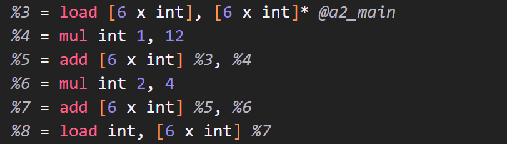    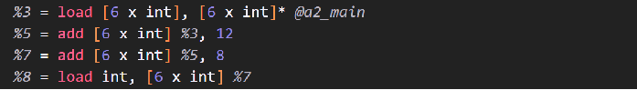

ConstantPass部分代码：

```
...

/*消除该条指令，并且用新得到的irnewconst代替所有的uses*/
                if(inst->getOpcode() <= IRInstruction::BinaryOps::Xor){
                    IRConstant* irnewconst;
                    if(inst->getOperand(0)->getType()->getPrimitiveID() == IRType::BoolTyID) {
                        irnewconst = judge(inst->getOpcode(),
                                        dynamic_cast<IRConstantBool*>(inst->getOperand(0)), 
                                        dynamic_cast<IRConstantBool*>(inst->getOperand(1)));
                    }else{
                        irnewconst = alge(inst->getOpcode(),
                                        dynamic_cast<IRConstant*>(inst->getOperand(0)), 
                                        dynamic_cast<IRConstant*>(inst->getOperand(1)));
                    }

                    inst->dropAllReferences();
                    instIterator = BB.getInstList().erase(instIterator);
                    inst->replaceAllUsesWith(irnewconst);

                    flag = false;
                }

...
```

##### SubExpPass

SubExpPass主要分为两个部分；首先是LocalSubExpPass(局部公共子表达式消除)，然后是GlobalSubExpPass(全局公共子表达式消除)；

###### LocalSubExpPass(局部公共子表达式消除)

LocalSubExpPass相对比较简单，只用针对每个基本块进行操作。如果满足两条指令的操作数完全相同(这两条指令不能是br，call等不能够被替代的指令)，那么将用第一条指令IrValue替代掉所有使用第二条指令IrValue的地方。

LocalSubExpPass算法步骤：

1. 以基本块为单位，有两层for循环，以外层循环当前的指令为父指令，内层循环当前的指令为子指令，查询是否可以用父指令替代掉子指令；
2. 重复上述步骤1不断迭代，直至在某一轮局部子表达式消除的过程中发现基本块中已经没有局部子表达式来进行消除。

LocalSubExpPass优化效果：

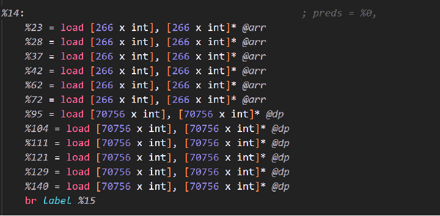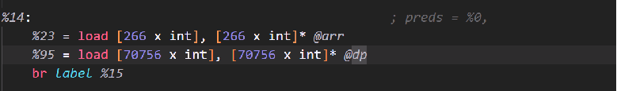

###### GlobalSubExpPass(全局公共子表达式消除/常规全局消除)

GlobalSubExpPass的全局消除大致思路与Local一致，根据支配树来进行操作，支配树算法可以保证树上每个节点都是其子节点必经的最近邻基本块。因此可以在GlobalSubExpPass中维护一个irdomiinstArray数组。

GlobalSubExpPass(常规全局消除)算法步骤：

1. 根据irdomiinstArray数组中的指令，来消除当前基本块中所有操作数相同的指令(类似于局部子表达式消除)；
2. 将该基本块中剩余的所有指令压入irdomiinstArray作为当前遍历所有基本块后得出的所有父指令，然后依次遍历该结点的所有子结点。不断递归，最终将所有基本块中的子表达式消除。

GlobalSubExpPass(常规全局消除)优化效果：

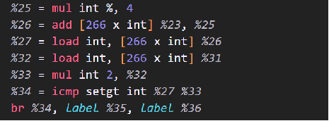   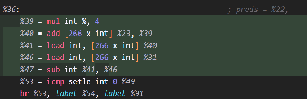

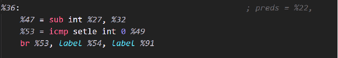

###### GlobalSubExpPass（激进load/store消除）算法

* 采用激进消除的原因在于发现对于内存的load并不会修改内存的值，因此考虑在没有store打断的情况下尽可能采用父load的指令来代替子load指令；
* 大体步骤与常规消除一致，区别在于采用irloadstoreArray来维护当前指令时，如果对于内存中某一个地址出现load或者store，会根据情况考虑将父指令顶替掉或者对子指令进行子表达式消除。

GlobalSubExpPass(激进load/store消除)注意点：

* 关于顶替还是指令消除：在对同一个地址的消除中，可能会产生ld->st，ld->ld，st->ld，st->st四种情况。这四种情况中，只有ld->ld的情况会用父指令进行子表达式消除，其余情况都会用子指令进行替代；
* 在回溯的过程中，注意不可以像普通消除中直接pop_back()掉所有当前块的指令，st指令不能够进行pop。原因是即使在支配书上不会直接进行支配，st指令仍然可能通过一条路径对后续的load进行影响。

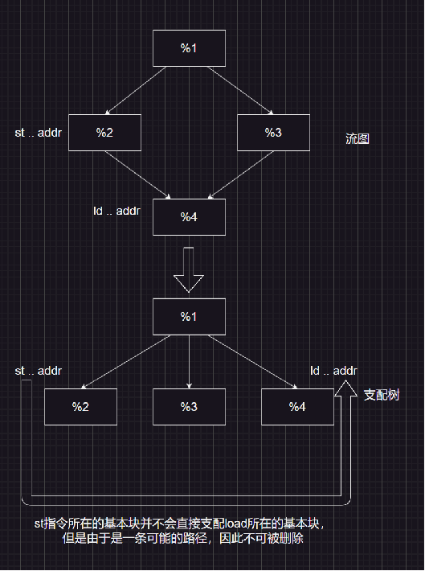

GlobalSubExpPass(激进load/store消除)优化效果：

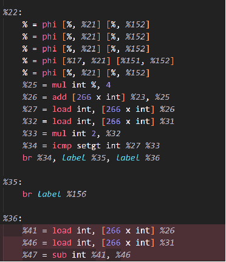 			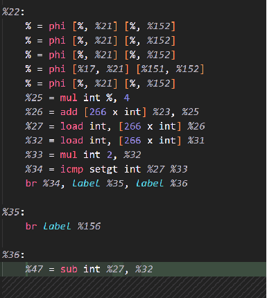

上述的两种全局消除算法互为补充，经过多次迭代可能会去的更好的效果，因此采用在主函数中用while循环来判断是否继续进行优化(如果当前有优化效果则继续进行优化)。

LocalSubExpPass部分代码：

```
...

 /*满足两者操作类型相同，并且以下几种指令是不可以消除局部公共子表达式的*/
                if( (irinst1->getOpcode() == irinst2->getOpcode()) &&
                    (irinst1->getOpcode() != IRInstruction::Br)    &&
                    (irinst1->getOpcode() != IRInstruction::PHI)   &&
                    (irinst1->getOpcode() != IRInstruction::Load) &&
                    (irinst1->getOpcode() != IRInstruction::Store) &&
                    (irinst1->getOpcode() != IRInstruction::Memcpy) &&
                    (irinst1->getOpcode() != IRInstruction::Call) &&
                    (irinst1->getOpcode() != IRInstruction::Alloca) &&
                    (irinst1->getOpcode() != IRInstruction::Ret)){
                    /*如果是可交换的，则两方都需要进行考虑*/
                    if(irinst1->isCommutative()){
                        if( (irinst1->getOperand(0) == irinst2->getOperand(0) && irinst1->getOperand(1) == irinst2->getOperand(1)) ||
                            (irinst1->getOperand(0) == irinst2->getOperand(1) && irinst1->getOperand(1) == irinst2->getOperand(0))){
                                flag = true;
                            }
                    }else{
                        /*按顺序进行检验*/
                        for(unsigned k=0; k<irinst1->getNumOperands(); k++){
                            if(irinst1->getOperand(k) == irinst2->getOperand(k)){ flag = true; }
                            else{ flag = false; break;}
                        }
                    }
                }

...
```

GlobalSubExpPass部分代码：

```
...

/*支配路径上的所有指令连同当前块的所有指令放到irchildinstarray里，然后继续沿着支配路径往下走*/
    for (auto inst: BB.getInstList()) {
        irdomiinstArray.push_back(inst);
    }


    for (auto domi: BB.getDominatorTree(cfg)->children) {
        auto childBB = domi->basicBlock;
        childrenSubExp(*childBB, cfg);
    }


    for (unsigned k = 0; k < BB.getInstList().size(); k++) {
        irdomiinstArray.pop_back();
    }
...

/*
     * 在回溯过程中，将load指令全部消除
     * 不消store指令的原因：store指令虽然不支配后面的节点，但是仍可能会通过某条路径产生影响，因此不消除
     * 消除load的原因：load可能是因为一条可能的路径而产生的load，并不能保证都在后面的load之前执行(后面的load可能仍需要进行操作)，因此需要消除
     */
    for (unsigned k = 0; k < BB.getInstList().size(); k++) {
        for (unsigned t = 0; t < irloadstoreArray.size();) {
            if (BB.getInstList()[k] == irloadstoreArray[t] &&
                BB.getInstList()[k]->getOpcode() == IRInstruction::Load) {
                auto ircancelinst =
                        std::find(irloadstoreArray.begin(), irloadstoreArray.end(),
                                  irloadstoreArray[t]);
                irloadstoreArray.erase(ircancelinst);
            } else {
                t++;
            }
        }
    }
```

##### RegisterPass

RegisterPass主要根据k着色图算法来对寄存器进行分配。在register算法中会考虑到move指令，最终形成的结果是给每个需要寄存器的IRValue指令给出一个getReg()接口，方便后端生成RISCV代码；

RegisterPass算法步骤：

1. 通过phi指令转化为move指令，消除掉所有的phi方便后续的寄存器分配；
2. 对每个函数进行活跃变量分析，得到每条指令的前驱后继有哪些活跃变量；
3. 根据活跃变量分析得到的结果构造冲突图，在冲突图上跑寄存器分配算法，最终得到变量需要的寄存器。

步骤1：

将phi指令转化为move指令(根据phi指令中前驱基本块的信息，将move指令加入到前驱基本块中跳转指令的末尾)；

PHideletePass算法效果：

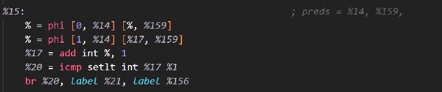

步骤2：

LiveVariable算法步骤：

1. 在每一个基本块内部，从基本块末尾开始向开头处逆序分析；根据公式INLive=OUTLive+{use}-{def}，迭代到基本块开头处，即可得到每一条指令入口与出口处的活跃变量；
2. 在每一个函数内部，对基本块的入口与出口处不断进行迭代；根据公式OUTLive=U{INLive}，INLive则不断循环调用步骤1，实现对每个基本块入口与出口处的活跃变量分析；当整个算法到达不动点(即每个基本快入口出口的活跃变量均固定时)，即算法成功。

LiveVariable算法效果：

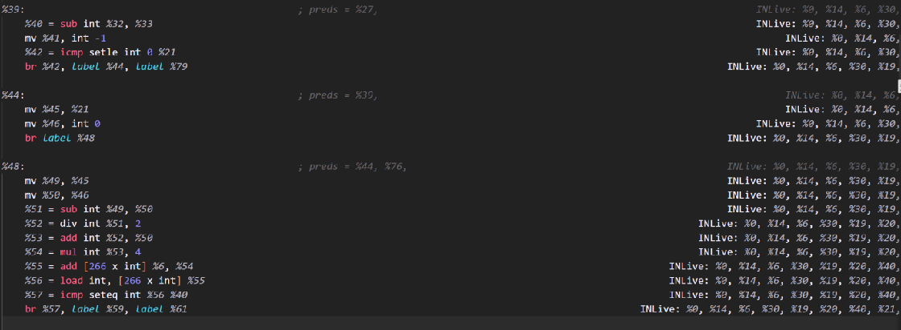

步骤3：

RegisterPass算法步骤：

1. 构造冲突图；
2. 简化/合并；
3. 冻结/溢出；
4. 颜色指派/重写程序。

RegisterPass算法效果：

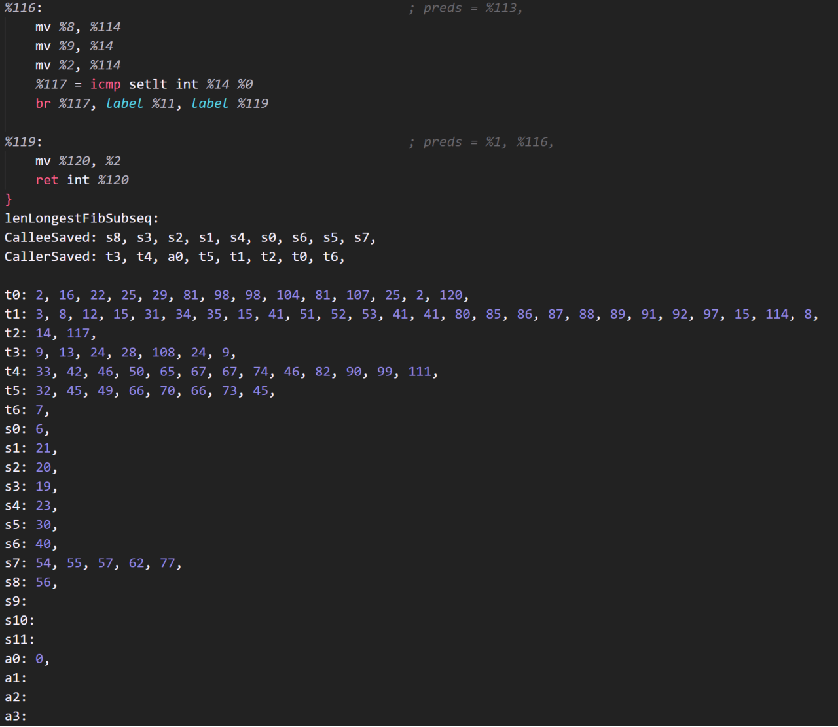

LiveVariable算法代码：

```
...
 
/*一直迭代到不动点*/
    while(flag){
        flag = false;
        for(auto BB:F->getBasicBlockList()){
            /*OUT[B] = U(S是B的一个后继)IN[S]*/
            for(auto succBB: BB->findSuccessor()){
                for(auto ir: *succBB->getLive()->getINLive()){
                    BB->getLive()->getOUTLive()->push_back(ir);
                }
            }

            /*对OUT进行去重处理*/
            auto OUTLive = BB->getLive()->getOUTLive();
            /*去重处理*/
            std::sort(OUTLive->begin(), OUTLive->end());
            OUTLive->erase(std::unique(OUTLive->begin(), OUTLive->end()), OUTLive->end());

            /*调用基本块内部的活跃变量分析得到基本块开头的Live变量*/
            LiveVariableInst::genLiveVariableInst(BB);

            /*IN[B] = OUT[inst]*/
            auto newINLive = BB->getInstList()[0]->getLive()->getINLive();
            if(!std::equal(newINLive->begin(), newINLive->end(),  BB->getLive()->getINLive()->begin(),  BB->getLive()->getINLive()->end()))
                flag = true;
            *BB->getLive()->getINLive() = *newINLive;
        }
    }

...
```

RegisterPass算法代码：

```
...

void RegisterNode::RegisterAlloc(IRFunction &F, WHICH which){
    /*初始化寄存器分配需要的静态变量*/
    curF = &F;
    RegisterNode::which = which;

    /*开始寄存器分配*/
    Build();
    MakeWorklist();
    while(!(simplifyWorklist.empty() && worklistMoves.empty() && freezeWorklist.empty() && spillWorklist.empty())){
        if(!simplifyWorklist.empty()) simplify();
        else if(!worklistMoves.empty()) Coalesce();
        else if(!freezeWorklist.empty()) Freeze();
        else if(!spillWorklist.empty()) SelectSpill();
    }
    AssignColors();
    if(!spilledNodes.empty()){
        RewriteProgram();
        RegisterAlloc(F, which);
    }
}

...
```

### 分成员总结

苑骏康：

汪铭煜：

盛子轩：本次实验中，我参与了IR代码优化Pass的书写，主要负责了常量传播，局部公共子表达式消除，全局公共子表达式消除，以及最终的寄存器分配；在写优化代码的过程中，我深刻体会到了局部优化与全局优化的不同点，并知道了如何运用流图和支配树；在寄存器分配的过程中，我明白了如何进行活跃变量分析，以及如何根据move指令合并进行寄存器分配，以及k着色寄存器分配的基本操作。我在写优化pass代码的过程中，将书上的知识加以灵活运用，在实践中加深了对编译优化的理解
