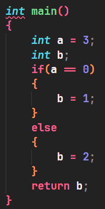
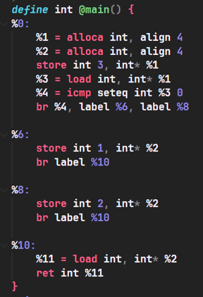

[toc]

# 编译原理研讨课实验PR003实验报告

本次实验代码版本位于 tag：prj3。

## 任务说明

1. 掌握从IR到汇编的翻译过程
2. 掌握栈的组织和管理形式，正确实现变量初始化与递归调用
3. 端到端编译CACT源码到riscv64gc汇编⽂件(.S)，先完成再完美
4. 了解中间表示上可实现的性能优化变换，以及三地址表示对优化的帮助

## 成员组成

汪铭煜

盛子轩

苑骏康

## 实验设计

### 设计思路

#### 设计编译器的目录结构

> /cact/src/Pass/

   对应的各个优化Pass，对IR代码进行优化

> /cact/src/RISC-V

> /cact/src/

    Optimizer.h
    Optimizer.cpp 负责建立优化类，并通过run函数来对IR代码进行优化

### 实验实现

整个实验大致可以分为两个部分：优化Pass，RISCV后端的生成。

#### 优化Pass

优化Pass负责对已有的IR中间代码进行优化，进行常数、循环、寄存器分配等方面的优化，为每个变量提供寄存器，方便最终RISCV代码的生成。

##### Men2RegPass

静态单赋值（SSA）在 LLVM IR 中体现为每个虚拟寄存器只有一次赋值点。这种规定会给后续的优化带来很大的便利，但是同时也引来了麻烦，比如下面的程序。

```c++
a = 0;
if (b > 0)
    a = 1;
else
    a = 2;
```

如果按照 c 语言的思路，我们会这样翻译

```
	%a = 0
	%1 = icmp setgt %b 0
	br %1 label %true label %false
%true:
	%a = 1
	br label %next
%false:
	%a = 2
	br label %next
%next:
```

但这样是错误的，%a 被赋值了 3 次，这不符合 SSA 的要求。如何修改？有两种方法。

**方法 1：load/store**

LLVM 的 SSA 仅要求对虚拟寄存器的赋值是单赋值，所以我们可以用内存开后门。

```
	%a = alloc int*
	%b = alloc int*
	store 0 %a
	%1 = load int %b
	%2 = icmp setgt %1 0
	br %2 label %true label %false
%true:
	store 1 %a
	br label %next
%false:
	store 2 %a
	br label %next
%next:
```

通过 alloc 在栈上为变量申请空间，通过多次 store 完成对变量的赋值。这样就使得代码符合 SSA 的要求。但是，这种做法使得每次变量的使用都需要访问内存。代码的性能非常差。

**方法2：phi**

我们引入 phi 语句。

```
	%a1 = 0
	%1 = icmp setgt %b1 0
	br %1 label %true label %false
%true:
	%a2 = 1
	br label %next
%false:
	%a3 = 2
	br label %next
%next:
	%a4 = phi [%a2 %true] [%a3 %false]
```

上面代码中，%a4 使用 phi 赋值，如果上一个基本块是 %true，值是 %a2，如果上一个基本块是 %false，值是 %a3。%a1，%a2，%a3，%a4 是 a 的值。可以看出，引入 phi 语句让变量 a 的地址消失了，取而代之的是 a 的值。

方法 1 代码生成简单，但效率低，方法 2 代码生成困难但效率高，如何平衡？前端使用方法 1 生成 SSA 形式的代码，优化器通过 Mem2Reg pass 将前端生成的代码转换成等效的方法 2 形式的代码。

Mem2RegPass算法步骤：

1. **构建控制流图** IRBasicBlock 最后的控制语句指向下一个 IRBasicBlock 所以只需要遍历一遍就可以构建出控制流图。
2. **根据控制流图构建支配树** 我们在任意的一个有向图上钦定一个入口结点 s，对于一个结点 u，若从 s 到 u 的每一条路径都经过某一个结点 v，那么我们称 v 支配 u，也称 v 是 u 的一个支配点。可以证明，这样的支配关系是一个树结构。在 CFG 中入口节点代表一个函数的 entryBasicBlock。因此，可以对于 CFG 构建一棵支配树。我们使用了 Lengauer–Tarjan 算法来构造支配树。
3. **结合控制流图和支配树计算支配边界** 一个节点的支配边界是节点的集合。一个点的支配边界就是从改点出发第一次遇到的不被该点支配的节点。
4. **在支配边界插入** **phi** 对于每一条对变量定值的指令（store, phi），在其 basicblock 的支配边界的 basicblock 顶部生成 phi 语句。不断迭代直到没有新的 phi 语句被插入。
5. **遍历支配树重填** **phi** **的值** 以对支配树进行深度优先遍历的顺序遍历basicblock。对于每一条对变量定值的指令（store, phi），将最新的定值压入栈。对于每一条对变量使用的指令（load）,使用栈顶的值替换 load 出来的值。一个块扫描结束，枚举其在 CFG 上的所有后继块，在后继块的 phi 中加入本块对于 phi 所对应的变量的定值。

Mem2RegPass优化效果：



##### HoistingLoopInvariantValuePass

循环不变量外提负责将循环中不变的量外提到循环外，避免每次循环重新计算。

HoistingLoopInvariantValuePass算法步骤：

1. **loop rotate** 循环不变量外提需要把循环不变量外提到整个循环的必经节点上，目前的 while 循环结构并不合适。考虑将其变成 if + do-while 的形式。如下图，preheader 就是整个循环的必经节点。
2. **找到一个循环** 找回边。如果一个节点在 CFG 上的一个后继是其在支配树上的祖先，那么就存在一个循环。记这条边起始点为 latch，终点为 header。不断加入除了header 以外的点的前驱进入 loop，直到没有新的点加入。
3. **寻找循环不变量并外提** 满足下列条件之一的是循环不变量：常数、循环内没有到达定值、循环内到达定值只有一个并且该定值是循环不变量。根据上面的条件不断迭代循环不变量集合直到没有找到新的循环不变量。将所有循环不变量外提。

HoistingLoopInvariantValuePass优化效果：


##### DeadCodeEliminatePass

对于 LLVM IR 来说，如果一个指令的值没有被使用，即其 IRValue 的 Uses 为空则该代码为死代码，可以安全的删除。

##### ConstantPass

ConstantPass主要负责进行常量传播的消除，常量传播的消除在这里主要有三类需要进行考虑：

1. 两个操作数都是常数的情况，则消除该条指令，并将算出的常量替代掉所有使用这条指令的地方；
2. 该条指令的操作是加法，其中一个操作数是0；或者该条指令的操作是乘法，其中一个操作数是1；这时可以取消掉这条指令，并且将其中不为常数的那个操作数替代掉所有使用该条指令的地方；
3. 该条指令是一条比较指令，但是比较的操作数都是常数。这时可以将根据比较操作的常数操作数直接判断出该比较操作的跳转方向，从而避免了一条比较指令。

ConstantPass算法步骤：

1. 以基本块为单位，查询每条指令的操作类型和操作数。如果满足前文所述常量传播的条件，则进行常量传播的消除；
2. 重复上述步骤1，直到确定在每一个基本块中都不存在上述可被常量传播消除的指令(如果一条指令被常量传播消除掉，替代这条指令的常数可能会导致其他指令也变成可被常量传播消除的指令)。

ConstantPass优化效果：

    

ConstantPass部分代码：

```
...

/*消除该条指令，并且用新得到的irnewconst代替所有的uses*/
                if(inst->getOpcode() <= IRInstruction::BinaryOps::Xor){
                    IRConstant* irnewconst;
                    if(inst->getOperand(0)->getType()->getPrimitiveID() == IRType::BoolTyID) {
                        irnewconst = judge(inst->getOpcode(),
                                        dynamic_cast<IRConstantBool*>(inst->getOperand(0)), 
                                        dynamic_cast<IRConstantBool*>(inst->getOperand(1)));
                    }else{
                        irnewconst = alge(inst->getOpcode(),
                                        dynamic_cast<IRConstant*>(inst->getOperand(0)), 
                                        dynamic_cast<IRConstant*>(inst->getOperand(1)));
                    }

                    inst->dropAllReferences();
                    instIterator = BB.getInstList().erase(instIterator);
                    inst->replaceAllUsesWith(irnewconst);

                    flag = false;
                }

...
```

##### SubExpPass

SubExpPass主要分为两个部分；首先是LocalSubExpPass(局部公共子表达式消除)，然后是GlobalSubExpPass(全局公共子表达式消除)；

###### LocalSubExpPass(局部公共子表达式消除)

LocalSubExpPass相对比较简单，只用针对每个基本块进行操作。如果满足两条指令的操作数完全相同(这两条指令不能是br，call等不能够被替代的指令)，那么将用第一条指令IrValue替代掉所有使用第二条指令IrValue的地方。

LocalSubExpPass算法步骤：

1. 以基本块为单位，有两层for循环，以外层循环当前的指令为父指令，内层循环当前的指令为子指令，查询是否可以用父指令替代掉子指令；
2. 重复上述步骤1不断迭代，直至在某一轮局部子表达式消除的过程中发现基本块中已经没有局部子表达式来进行消除。

LocalSubExpPass优化效果：


###### GlobalSubExpPass(全局公共子表达式消除/常规全局消除)

GlobalSubExpPass的全局消除大致思路与Local一致，根据支配树来进行操作，支配树算法可以保证树上每个节点都是其子节点必经的最近邻基本块。因此可以在GlobalSubExpPass中维护一个irdomiinstArray数组。

GlobalSubExpPass(常规全局消除)算法步骤：

1. 根据irdomiinstArray数组中的指令，来消除当前基本块中所有操作数相同的指令(类似于局部子表达式消除)；
2. 将该基本块中剩余的所有指令压入irdomiinstArray作为当前遍历所有基本块后得出的所有父指令，然后依次遍历该结点的所有子结点。不断递归，最终将所有基本块中的子表达式消除。

GlobalSubExpPass(常规全局消除)优化效果：

   


###### GlobalSubExpPass（激进load/store消除）算法

* 采用激进消除的原因在于发现对于内存的load并不会修改内存的值，因此考虑在没有store打断的情况下尽可能采用父load的指令来代替子load指令；
* 大体步骤与常规消除一致，区别在于采用irloadstoreArray来维护当前指令时，如果对于内存中某一个地址出现load或者store，会根据情况考虑将父指令顶替掉或者对子指令进行子表达式消除。

GlobalSubExpPass(激进load/store消除)注意点：

* 关于顶替还是指令消除：在对同一个地址的消除中，可能会产生ld->st，ld->ld，st->ld，st->st四种情况。这四种情况中，只有ld->ld的情况会用父指令进行子表达式消除，其余情况都会用子指令进行替代；
* 在回溯的过程中，注意不可以像普通消除中直接pop_back()掉所有当前块的指令，st指令不能够进行pop。原因是即使在支配书上不会直接进行支配，st指令仍然可能通过一条路径对后续的load进行影响。


GlobalSubExpPass(激进load/store消除)优化效果：

 			

上述的两种全局消除算法互为补充，经过多次迭代可能会去的更好的效果，因此采用在主函数中用while循环来判断是否继续进行优化(如果当前有优化效果则继续进行优化)。

LocalSubExpPass部分代码：

```
...

 /*满足两者操作类型相同，并且以下几种指令是不可以消除局部公共子表达式的*/
                if( (irinst1->getOpcode() == irinst2->getOpcode()) &&
                    (irinst1->getOpcode() != IRInstruction::Br)    &&
                    (irinst1->getOpcode() != IRInstruction::PHI)   &&
                    (irinst1->getOpcode() != IRInstruction::Load) &&
                    (irinst1->getOpcode() != IRInstruction::Store) &&
                    (irinst1->getOpcode() != IRInstruction::Memcpy) &&
                    (irinst1->getOpcode() != IRInstruction::Call) &&
                    (irinst1->getOpcode() != IRInstruction::Alloca) &&
                    (irinst1->getOpcode() != IRInstruction::Ret)){
                    /*如果是可交换的，则两方都需要进行考虑*/
                    if(irinst1->isCommutative()){
                        if( (irinst1->getOperand(0) == irinst2->getOperand(0) && irinst1->getOperand(1) == irinst2->getOperand(1)) ||
                            (irinst1->getOperand(0) == irinst2->getOperand(1) && irinst1->getOperand(1) == irinst2->getOperand(0))){
                                flag = true;
                            }
                    }else{
                        /*按顺序进行检验*/
                        for(unsigned k=0; k<irinst1->getNumOperands(); k++){
                            if(irinst1->getOperand(k) == irinst2->getOperand(k)){ flag = true; }
                            else{ flag = false; break;}
                        }
                    }
                }

...
```

GlobalSubExpPass部分代码：

```
...

/*支配路径上的所有指令连同当前块的所有指令放到irchildinstarray里，然后继续沿着支配路径往下走*/
    for (auto inst: BB.getInstList()) {
        irdomiinstArray.push_back(inst);
    }


    for (auto domi: BB.getDominatorTree(cfg)->children) {
        auto childBB = domi->basicBlock;
        childrenSubExp(*childBB, cfg);
    }


    for (unsigned k = 0; k < BB.getInstList().size(); k++) {
        irdomiinstArray.pop_back();
    }
...

/*
     * 在回溯过程中，将load指令全部消除
     * 不消store指令的原因：store指令虽然不支配后面的节点，但是仍可能会通过某条路径产生影响，因此不消除
     * 消除load的原因：load可能是因为一条可能的路径而产生的load，并不能保证都在后面的load之前执行(后面的load可能仍需要进行操作)，因此需要消除
     */
    for (unsigned k = 0; k < BB.getInstList().size(); k++) {
        for (unsigned t = 0; t < irloadstoreArray.size();) {
            if (BB.getInstList()[k] == irloadstoreArray[t] &&
                BB.getInstList()[k]->getOpcode() == IRInstruction::Load) {
                auto ircancelinst =
                        std::find(irloadstoreArray.begin(), irloadstoreArray.end(),
                                  irloadstoreArray[t]);
                irloadstoreArray.erase(ircancelinst);
            } else {
                t++;
            }
        }
    }
```

##### RegisterPass

RegisterPass主要根据k着色图算法来对寄存器进行分配。在register算法中会考虑到move指令，最终形成的结果是给每个需要寄存器的IRValue指令给出一个getReg()接口，方便后端生成RISCV代码；

RegisterPass算法步骤：

1. 通过phi指令转化为move指令，消除掉所有的phi方便后续的寄存器分配；
2. 对每个函数进行活跃变量分析，得到每条指令的前驱后继有哪些活跃变量；
3. 根据活跃变量分析得到的结果构造冲突图，在冲突图上跑寄存器分配算法，最终得到变量需要的寄存器。

步骤1：

将phi指令转化为move指令(根据phi指令中前驱基本块的信息，将move指令加入到前驱基本块中跳转指令的末尾)；

PHideletePass算法效果：


步骤2：

LiveVariable算法步骤：

1. 在每一个基本块内部，从基本块末尾开始向开头处逆序分析；根据公式INLive=OUTLive+{use}-{def}，迭代到基本块开头处，即可得到每一条指令入口与出口处的活跃变量；
2. 在每一个函数内部，对基本块的入口与出口处不断进行迭代；根据公式OUTLive=U{INLive}，INLive则不断循环调用步骤1，实现对每个基本块入口与出口处的活跃变量分析；当整个算法到达不动点(即每个基本快入口出口的活跃变量均固定时)，即算法成功。

LiveVariable算法效果：


步骤3：

RegisterPass算法步骤：

1. 构造冲突图；
2. 简化/合并；
3. 冻结/溢出；
4. 颜色指派/重写程序。

RegisterPass算法效果：


LiveVariable算法代码：

```
...
 
/*一直迭代到不动点*/
    while(flag){
        flag = false;
        for(auto BB:F->getBasicBlockList()){
            /*OUT[B] = U(S是B的一个后继)IN[S]*/
            for(auto succBB: BB->findSuccessor()){
                for(auto ir: *succBB->getLive()->getINLive()){
                    BB->getLive()->getOUTLive()->push_back(ir);
                }
            }

            /*对OUT进行去重处理*/
            auto OUTLive = BB->getLive()->getOUTLive();
            /*去重处理*/
            std::sort(OUTLive->begin(), OUTLive->end());
            OUTLive->erase(std::unique(OUTLive->begin(), OUTLive->end()), OUTLive->end());

            /*调用基本块内部的活跃变量分析得到基本块开头的Live变量*/
            LiveVariableInst::genLiveVariableInst(BB);

            /*IN[B] = OUT[inst]*/
            auto newINLive = BB->getInstList()[0]->getLive()->getINLive();
            if(!std::equal(newINLive->begin(), newINLive->end(),  BB->getLive()->getINLive()->begin(),  BB->getLive()->getINLive()->end()))
                flag = true;
            *BB->getLive()->getINLive() = *newINLive;
        }
    }

...
```

RegisterPass算法代码：

```
...

void RegisterNode::RegisterAlloc(IRFunction &F, WHICH which){
    /*初始化寄存器分配需要的静态变量*/
    curF = &F;
    RegisterNode::which = which;

    /*开始寄存器分配*/
    Build();
    MakeWorklist();
    while(!(simplifyWorklist.empty() && worklistMoves.empty() && freezeWorklist.empty() && spillWorklist.empty())){
        if(!simplifyWorklist.empty()) simplify();
        else if(!worklistMoves.empty()) Coalesce();
        else if(!freezeWorklist.empty()) Freeze();
        else if(!spillWorklist.empty()) SelectSpill();
    }
    AssignColors();
    if(!spilledNodes.empty()){
        RewriteProgram();
        RegisterAlloc(F, which);
    }
}

...
```

#### RISCV后端

1. **逐条翻译** 由于LLVM IR形式接近底层汇编语言，所以我们在后端设计上采用了对IR语句逐条翻译的形式，每个IRValue在寄存器分配阶段分配了寄存器，通过getReg()方法得到其分配的寄存器。
2. **函数调用** 函数调用ABI为RISCV手册规定。在进入函数之后，我们将该函数使用到的所有的callee寄存器保存在栈上，在函数返回时恢复。在调用函数时，我们将调用者所用到的所有caller寄存器保存到栈上，调用结束后恢复。函数临时变量在进入函数之后在栈上为其申请空间。函数栈帧16字节对齐。
3. **立即数处理** 在寄存器分配时尝试对函数中立即数进行寄存器分配，如果立即数被分配了寄存器，在函数开头将立即数放入寄存器中，对于整数使用li语句；对于浮点数，先创建一个浮点常量，在将其load进寄存器。
   如果立即数没有被分配寄存器，那么在翻译时临时借用一个寄存器x，先将x的内容保存到栈上，再使用x装载立即数，在语句执行后恢复x原先的内容。有关x的选择：优先选择空闲的寄存器，如果没有，随机将一个与该指令无关联的寄存器逐出到栈上，使用完后恢复。

#### 优化结果

O1选项：打开常量传播、公共⼦表达式删除、mem2reg、死代码删除

O2选项：在O1的基础上打开图着色寄存器分配、循环⽆关表达式外提

优化结果如下图：


我们将自己的CACTcompiler与riscv64-unknown-elf-gcc对比，可以看到在两个优化层级（O1、O2）上总体和gcc还有一些差距。但是对比自身的O0、O1、O2选项，进步还是很明显的。

### 分成员总结

苑骏康：本次实验中，我参与了解释器的维护和project3的课堂汇报，维护解释器用于检查生成IR和各个优化的正确性，我修改了project2中解释器设计上的漏洞，以避免模拟执行递归程序时出错：删除了从IRValue到TemporaryVariable的指针，在每次进入一个函数时都创建一个新的tempVarMap，用于查询一个IRValue在当前函数中对应的临时变量，从而使递归调用时每层调用使用的临时变量各不相同，而且都能从IRValue找到对应的临时变量。准备课堂汇报的过程中我也对各种优化算法有了更深的了解。

汪铭煜：本次实验中，我参与了IR代码优化Pass和后端的书写，主要负责了MemToReg，死代码删除，循环不变量外提；在学习优化算法的过程中，我学习了控制流图，支配树等概念，理解了优化Pass的设计理念。我灵活的综合了网上博客，llvm源代码和龙书虎书上的内容，最终完成了CACT编译的编写。在后端的编写中，我对于RISCV ABI的理解更加深入，对于RISCV汇编语句更加熟悉。

盛子轩：本次实验中，我参与了IR代码优化Pass的书写，主要负责了常量传播，局部公共子表达式消除，全局公共子表达式消除，以及最终的寄存器分配；在写优化代码的过程中，我深刻体会到了局部优化与全局优化的不同点，并知道了如何运用流图和支配树；在寄存器分配的过程中，我明白了如何进行活跃变量分析，以及如何根据move指令合并进行寄存器分配，以及k着色寄存器分配的基本操作。我在写优化pass代码的过程中，将书上的知识加以灵活运用，在实践中加深了对编译优化的理解
